Appendix I
================
Eric G. E. Nilsen
2 5 2021

# Imputed vs. Observed Density

This part will show the density between the imputed and observed values
for all variables.

<!-- --><!-- --><!-- --><!-- --><!-- --><!-- --><!-- --><!-- --><!-- --><!-- --><!-- --><!-- --><!-- --><!-- -->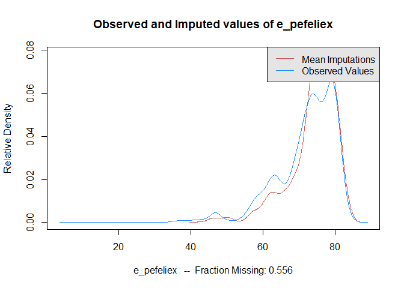<!-- --><!-- --><!-- --><!-- --><!-- --><!-- --><!-- --><!-- --><!-- --><!-- --><!-- --><!-- --><!-- --><!-- --><!-- --><!-- --><!-- --><!-- --><!-- --><!-- --><!-- --><!-- --><!-- -->

# Overimputation

In addition to the the variables shown in part 4.3, this section will
present the results of overimputing all variables in the dataset.

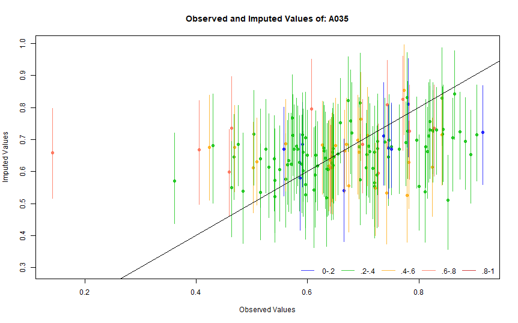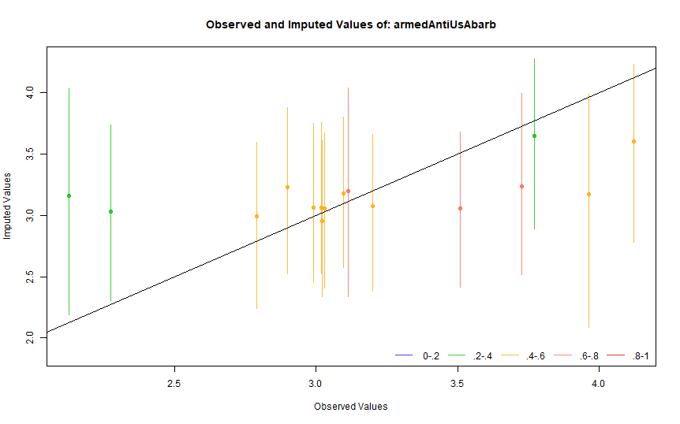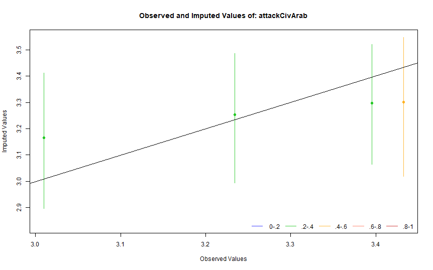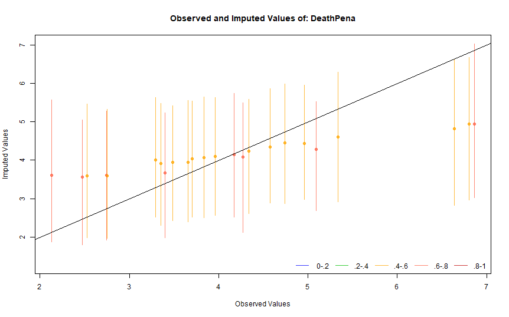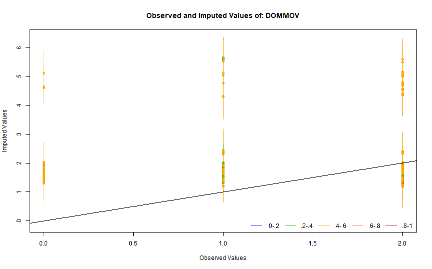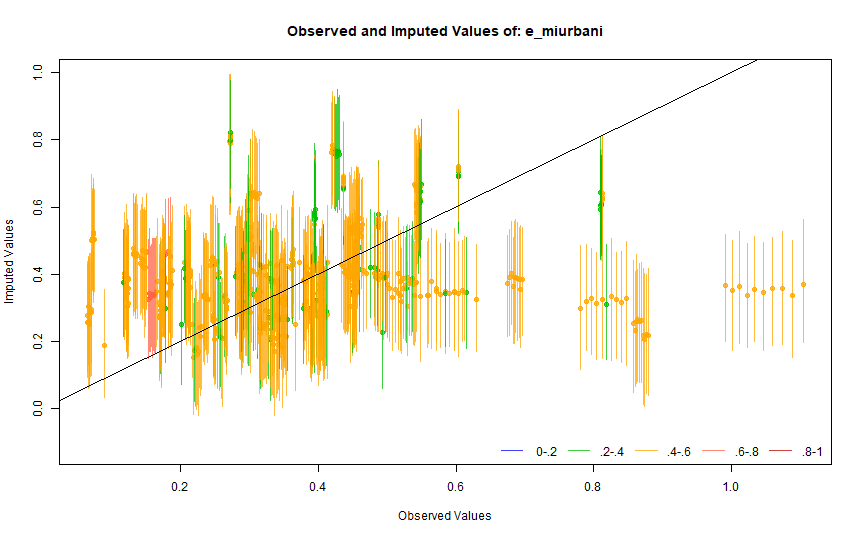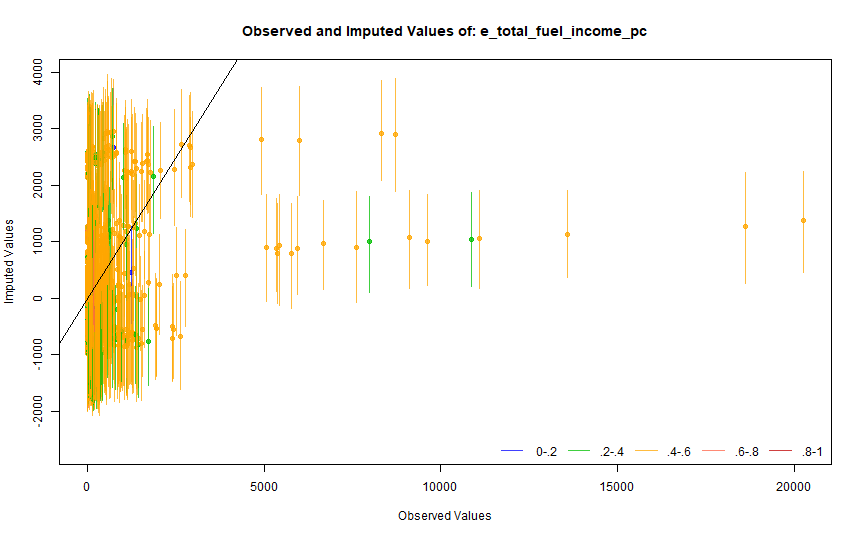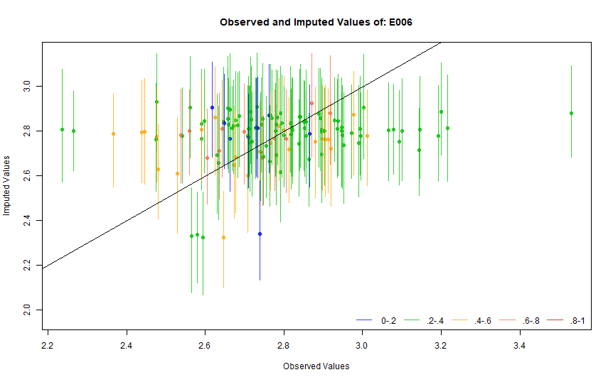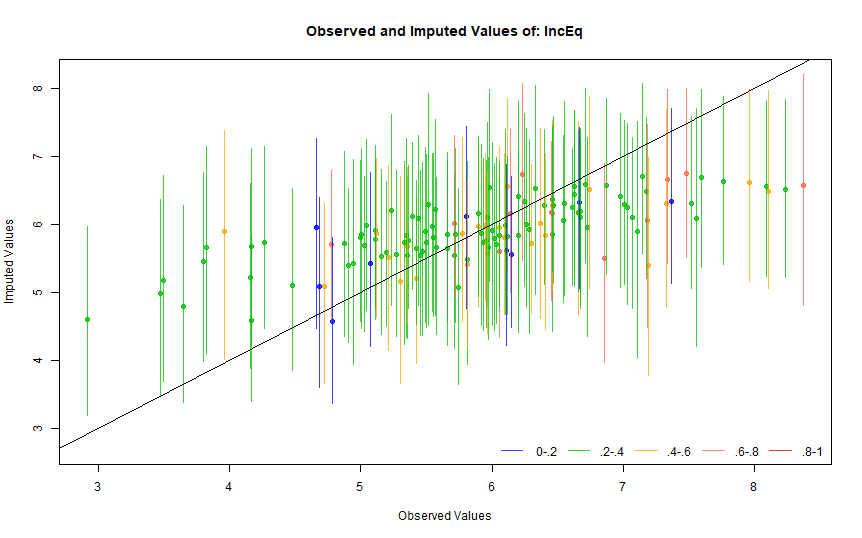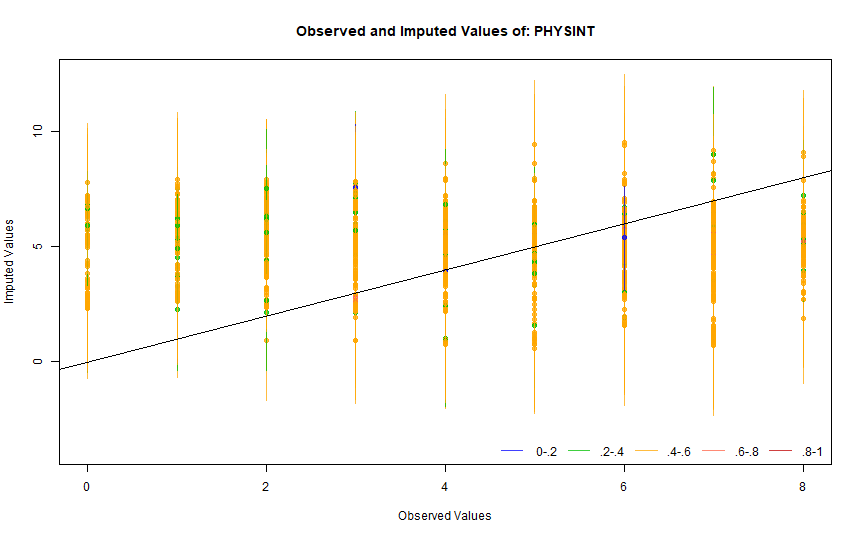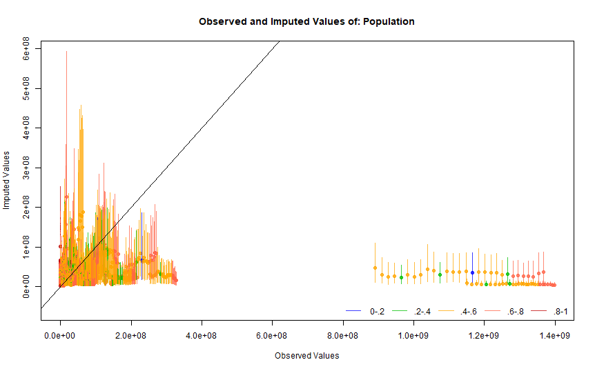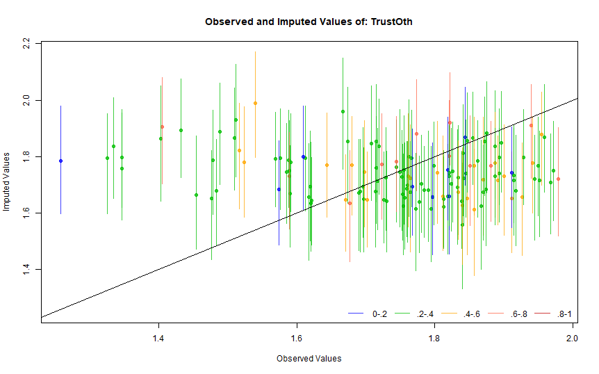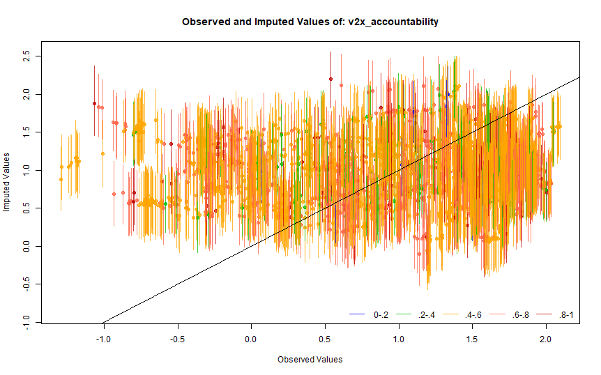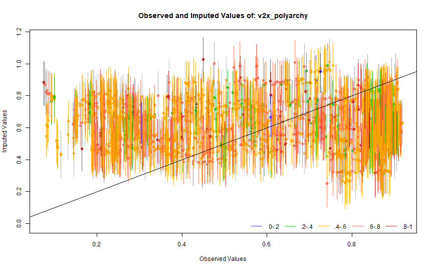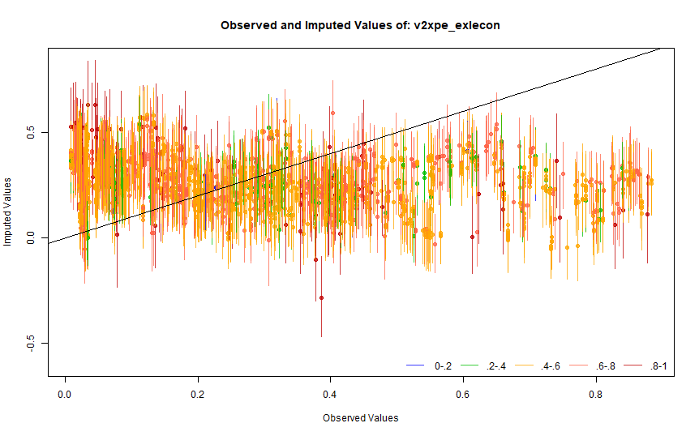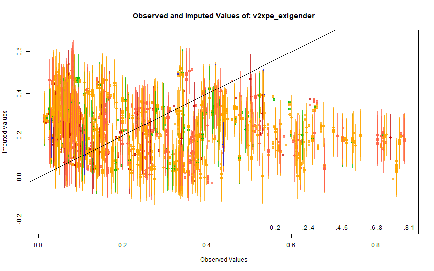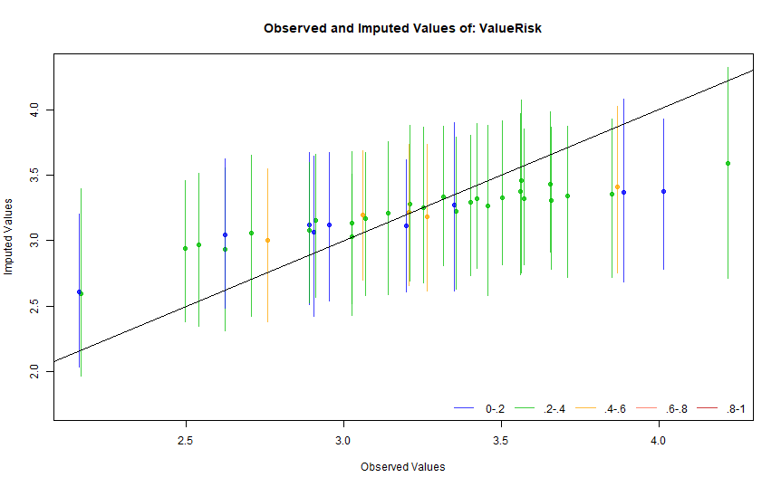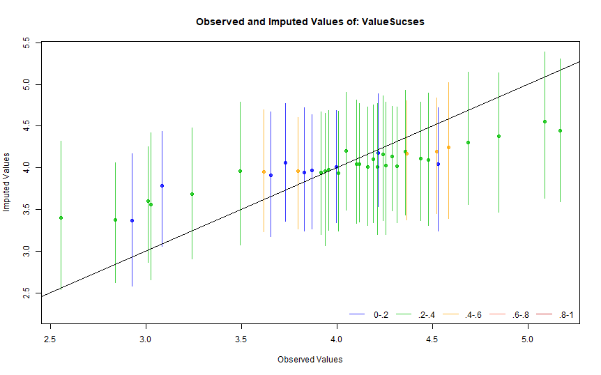

| Source          |                                                 Variable                                                  |    Period |
|-----------------|:---------------------------------------------------------------------------------------------------------:|----------:|
| WVS             |                                                   A189                                                    | 2005-2014 |
| WVS             |                                                   A190                                                    | 2005-2014 |
| WVS             |                                                   A191                                                    | 2005-2014 |
| WVS             |                                                   A192                                                    | 2005-2014 |
| WVS             |                                                   A193                                                    | 2005-2014 |
| WVS             |                                                   A194                                                    | 2005-2014 |
| WVS             |                                                   A195                                                    | 2005-2014 |
| WVS             |                                                   A196                                                    | 2005-2014 |
| WVS             |                                                   A197                                                    | 2005-2014 |
| WVS             |                                                   A198                                                    | 2005-2014 |
| WVS             |                                                   A199                                                    | 2005-2014 |
| WVS             |                                                   A035                                                    | 1981-2020 |
| WVS             |                                                   A039                                                    | 1981-2020 |
| WVS             |                                                   A008                                                    | 1981-2020 |
| WVS             |                                                   A029                                                    | 1981-2020 |
| WVS             |                                                   A170                                                    | 1981-2020 |
| WVS             |                                                   E012                                                    | 1981-2020 |
| WVS             |                                                 F114\_02                                                  | 2017-2020 |
| WVS             |                                                   E006                                                    | 1989-2020 |
| WVS             |                                                   C019                                                    | 1981-2004 |
| WVS             |                                                   A165                                                    | 1981-2020 |
| WVS             |                                                   E035                                                    | 1989-2020 |
| WVS             |                                                  E2333A                                                   | 2010-2020 |
| WVS             |                                                   X047                                                    | 1981-2020 |
| WVS             |                                                   X025R                                                   | 1981-2020 |
| WVS             |                                                   X003                                                    | 1981-2020 |
| WVS             |                                                   X001                                                    | 1981-2020 |
| WVS             |                                                   Y002                                                    | 1981-2020 |
| WVS             |                                                   Y003                                                    | 1981-2020 |
| Polity V        |                                                  polity                                                   | 1980-2020 |
| WB Open Data    |                                              NY.GDP.PCAP.CD                                               | 1980-2020 |
| WB Open Data    |                                                SP.POP.TOTL                                                | 1980-2020 |
| WB Open Data    |                                              EG.CFT.ACCS.ZS                                               | 1980-2020 |
| WB Open Data    |                                                SI.POV.GINI                                                | 1980-2020 |
| V-DEM v.11.1    |                                              v2x\_polyarchy                                               | 1980-2020 |
| V-DEM v.11.1    |                                             v2xpe\_exlgender                                              | 1980-2020 |
| V-DEM v.11.1    |                                      e\_total\_resources\_income\_pc                                      | 1980-2020 |
| V-DEM v.11.1    |                                                e\_pefeliex                                                | 1980-2020 |
| V-DEM v.11.1    |                                              v2xpe\_exlecon                                               | 1980-2020 |
| V-DEM v.11.1    |                                                e\_miurbani                                                | 1980-2020 |
| V-DEM v.11.1    |                                            v2x\_accountability                                            | 1980-2020 |
| V-DEM v.11.1    |                                        e\_total\_fuel\_income\_pc                                         | 1980-2020 |
| UNDP            |                                                    HDI                                                    | 1980-2020 |
| Afrobarometer   |                                          supdem ,q38,32,q30,q28                                           | 1999-2019 |
| Arabbarometer   |                                                 q604,q706                                                 | 2006-2018 |
| Arabbarometer   |                                                   q2476                                                   |      2006 |
| Arabbarometer   |                                                   q2476                                                   |      2006 |
| Latinobarometer | p19, sp31,sp28,P29ST,p46st, p32st, p14st,p13st,p16st,p17st,p9st,p13st, ,P10ST,P12STGBS, P11STGBS, P8STGBS | 1995-2018 |
| COW             |                                                majorpower                                                 | 1980-2012 |
| COW             |                                                   milex                                                   | 1980-2012 |
| COW             |                                                  milper                                                   | 1980-2012 |
| COW             |                                                   land                                                    | 1980-2012 |
| COW             |                                                    sea                                                    | 1980-2012 |
| COW             |                                                   cinc                                                    | 1980-2012 |
| COW             |                                                 num\_mem                                                  | 1980-2012 |
| MIDB 5.0        |                                                  dispnum                                                  | 1980-2014 |
| MIDB 5.0        |                                                   hiact                                                   | 1980-2014 |
| MIDB 5.0        |                                                  hostlev                                                  | 1980-2014 |
| MIDB 5.0        |                                                 fatality                                                  | 1980-2014 |
| MIDB 5.0        |                                                 fatalpre                                                  | 1980-2014 |
| CIRI            |                                                  DOMMOV                                                   | 1980-2011 |
| CIRI            |                                                   KILL                                                    | 1980-2011 |
| CIRI            |                                                  POLPRIS                                                  | 1980-2011 |
| CIRI            |                                                  PHYSINT                                                  | 1980-2011 |
| UCDP/PRIO       |                                            type\_of\_conflict                                             | 1980-2019 |
| UCDP/PRIO       |                                               conflict\_id                                                | 1980-2019 |
| UCDP/PRIO       |                                                  side\_a                                                  | 1980-2019 |
| UCDP/PRIO       |                                                  side\_b                                                  | 1980-2019 |
| UCDP/PRIO       |                                               side\_a\_2nd                                                | 1980-2019 |
| UCDP/PRIO       |                                               side\_b\_2nd                                                | 1980-2019 |
| UCDP/PRIO       |                                             intensity\_level                                              | 1980-2019 |

``` r
#Did not work
stargazer::stargazer(ImputedData[[1]][[1]] %>% select(Country, year), type = "text", summary = FALSE)
```

    ## 
    ## ==================
    ##      Country year 
    ## ------------------
    ## 1       8    1,998
    ## 2       8    2,002
    ## 3      12    2,002
    ## 4      12    2,014
    ## 5      20    2,005
    ## 6      20    2,018
    ## 7      31    1,997
    ## 8      31    2,011
    ## 9      32    1,984
    ## 10     32    1,991
    ## 11     32    1,995
    ## 12     32    1,999
    ## 13     32    2,006
    ## 14     32    2,013
    ## 15     32    2,017
    ## 16     36    1,981
    ## 17     36    1,995
    ## 18     36    2,005
    ## 19     36    2,012
    ## 20     36    2,018
    ## 21     40    1,990
    ## 22     40    1,999
    ## 23     40    2,008
    ## 24     50    1,996
    ## 25     50    2,002
    ## 26     50    2,018
    ## 27     51    1,997
    ## 28     51    2,008
    ## 29     51    2,011
    ## 30     56    1,981
    ## 31     56    1,990
    ## 32     56    1,999
    ## 33     56    2,009
    ## 34     70    1,998
    ## 35     70    2,001
    ## 36     76    1,991
    ## 37     76    1,997
    ## 38     76    2,006
    ## 39     76    2,014
    ## 40     76    2,018
    ## 41     100   1,991
    ## 42     100   1,997
    ## 43     100   2,006
    ## 44     100   2,008
    ## 45     112   1,990
    ## 46     112   1,996
    ## 47     112   2,008
    ## 48     112   2,011
    ## 49     124   1,982
    ## 50     124   1,990
    ## 51     124   2,000
    ## 52     124   2,006
    ## 53     152   1,990
    ## 54     152   1,996
    ## 55     152   2,000
    ## 56     152   2,006
    ## 57     152   2,012
    ## 58     152   2,018
    ## 59     156   1,990
    ## 60     156   1,995
    ## 61     156   1,995
    ## 62     156   1,995
    ## 63     156   2,001
    ## 64     156   2,001
    ## 65     156   2,001
    ## 66     156   2,001
    ## 67     156   2,007
    ## 68     156   2,013
    ## 69     156   2,013
    ## 70     156   2,013
    ## 71     156   2,018
    ## 72     158   1,998
    ## 73     158   2,006
    ## 74     158   2,012
    ## 75     158   2,019
    ## 76     170   1,997
    ## 77     170   1,998
    ## 78     170   2,005
    ## 79     170   2,012
    ## 80     170   2,018
    ## 81     191   1,996
    ## 82     191   2,008
    ## 83     196   2,006
    ## 84     196   2,008
    ## 85     196   2,011
    ## 86     196   2,019
    ## 87     203   1,991
    ## 88     203   1,998
    ## 89     203   2,008
    ## 90     208   1,981
    ## 91     208   1,990
    ## 92     208   1,999
    ## 93     208   2,008
    ## 94     218   2,013
    ## 95     218   2,018
    ## 96     231   2,007
    ## 97     231   2,007
    ## 98     231   2,020
    ## 99     233   1,990
    ## 100    233   1,996
    ## 101    233   2,008
    ## 102    233   2,011
    ## 103    246   1,981
    ## 104    246   1,990
    ## 105    246   1,996
    ## 106    246   2,005
    ## 107    246   2,009
    ## 108    250   1,981
    ## 109    250   1,990
    ## 110    250   1,990
    ## 111    250   1,999
    ## 112    250   1,999
    ## 113    250   2,006
    ## 114    250   2,008
    ## 115    268   1,996
    ## 116    268   2,008
    ## 117    268   2,009
    ## 118    268   2,014
    ## 119    276   1,981
    ## 120    276   1,990
    ## 121    276   1,997
    ## 122    276   2,006
    ## 123    276   2,008
    ## 124    276   2,013
    ## 125    276   2,018
    ## 126    288   2,007
    ## 127    288   2,012
    ## 128    300   1,999
    ## 129    300   1,999
    ## 130    300   2,008
    ## 131    300   2,017
    ## 132    320   2,004
    ## 133    320   2,020
    ## 134    344   2,005
    ## 135    344   2,014
    ## 136    344   2,018
    ## 137    348   1,982
    ## 138    348   1,991
    ## 139    348   1,998
    ## 140    348   2,008
    ## 141    348   2,009
    ## 142    352   1,984
    ## 143    352   1,990
    ## 144    352   1,999
    ## 145    352   2,009
    ## 146    356   1,990
    ## 147    356   1,995
    ## 148    356   2,001
    ## 149    356   2,006
    ## 150    356   2,012
    ## 151    360   2,001
    ## 152    360   2,006
    ## 153    360   2,018
    ## 154    364   2,000
    ## 155    364   2,007
    ## 156    364   2,007
    ## 157    364   2,020
    ## 158    368   2,004
    ## 159    368   2,006
    ## 160    368   2,013
    ## 161    368   2,018
    ## 162    372   1,981
    ## 163    372   1,990
    ## 164    372   1,999
    ## 165    372   2,008
    ## 166    380   1,981
    ## 167    380   1,990
    ## 168    380   1,999
    ## 169    380   1,999
    ## 170    380   2,005
    ## 171    380   2,009
    ## 172    392   1,981
    ## 173    392   1,990
    ## 174    392   1,995
    ## 175    392   2,000
    ## 176    392   2,005
    ## 177    392   2,010
    ## 178    392   2,010
    ## 179    392   2,019
    ## 180    398   2,011
    ## 181    398   2,018
    ## 182    400   2,001
    ## 183    400   2,007
    ## 184    400   2,014
    ## 185    400   2,018
    ## 186    410   1,982
    ## 187    410   1,990
    ## 188    410   1,996
    ## 189    410   2,001
    ## 190    410   2,005
    ## 191    410   2,010
    ## 192    410   2,010
    ## 193    410   2,018
    ## 194    417   2,003
    ## 195    417   2,011
    ## 196    417   2,020
    ## 197    422   2,013
    ## 198    422   2,018
    ## 199    428   1,990
    ## 200    428   1,996
    ## 201    428   2,008
    ## 202    440   1,990
    ## 203    440   1,997
    ## 204    440   2,008
    ## 205    442   1,999
    ## 206    442   2,008
    ## 207    458   2,006
    ## 208    458   2,012
    ## 209    458   2,018
    ## 210    470   1,983
    ## 211    470   1,991
    ## 212    470   1,999
    ## 213    470   2,008
    ## 214    484   1,981
    ## 215    484   1,990
    ## 216    484   1,996
    ## 217    484   2,000
    ## 218    484   2,005
    ## 219    484   2,012
    ## 220    484   2,018
    ## 221    498   1,996
    ## 222    498   2,002
    ## 223    498   2,006
    ## 224    499   1,996
    ## 225    499   2,001
    ## 226    504   2,001
    ## 227    504   2,007
    ## 228    504   2,011
    ## 229    528   1,981
    ## 230    528   1,990
    ## 231    528   1,999
    ## 232    528   1,999
    ## 233    528   2,006
    ## 234    528   2,008
    ## 235    528   2,012
    ## 236    554   1,998
    ## 237    554   2,004
    ## 238    554   2,011
    ## 239    554   2,020
    ## 240    566   1,990
    ## 241    566   1,995
    ## 242    566   2,000
    ## 243    566   2,012
    ## 244    566   2,018
    ## 245    578   1,982
    ## 246    578   1,990
    ## 247    578   1,996
    ## 248    578   2,007
    ## 249    578   2,008
    ## 250    586   1,997
    ## 251    586   2,001
    ## 252    586   2,001
    ## 253    586   2,012
    ## 254    586   2,018
    ## 255    604   1,996
    ## 256    604   2,001
    ## 257    604   2,006
    ## 258    604   2,012
    ## 259    604   2,018
    ## 260    608   1,996
    ## 261    608   2,001
    ## 262    608   2,012
    ## 263    608   2,019
    ## 264    616   1,989
    ## 265    616   1,997
    ## 266    616   2,005
    ## 267    616   2,008
    ## 268    616   2,012
    ## 269    620   1,990
    ## 270    620   1,999
    ## 271    620   2,008
    ## 272    620   2,020
    ## 273    630   1,995
    ## 274    630   2,001
    ## 275    630   2,018
    ## 276    642   1,993
    ## 277    642   1,998
    ## 278    642   2,005
    ## 279    642   2,008
    ## 280    642   2,012
    ## 281    642   2,018
    ## 282    643   1,990
    ## 283    643   1,995
    ## 284    643   1,995
    ## 285    643   1,995
    ## 286    643   2,006
    ## 287    643   2,006
    ## 288    643   2,006
    ## 289    643   2,008
    ## 290    643   2,008
    ## 291    643   2,008
    ## 292    643   2,008
    ## 293    643   2,008
    ## 294    643   2,011
    ## 295    643   2,011
    ## 296    643   2,017
    ## 297    646   2,007
    ## 298    646   2,012
    ## 299    688   1,996
    ## 300    688   2,001
    ## 301    688   2,006
    ## 302    688   2,017
    ## 303    702   2,002
    ## 304    702   2,012
    ## 305    703   1,990
    ## 306    703   1,998
    ## 307    703   2,008
    ## 308    704   2,001
    ## 309    704   2,006
    ## 310    704   2,020
    ## 311    705   1,992
    ## 312    705   1,995
    ## 313    705   2,005
    ## 314    705   2,008
    ## 315    705   2,011
    ## 316    710   1,982
    ## 317    710   1,990
    ## 318    710   1,996
    ## 319    710   2,001
    ## 320    710   2,006
    ## 321    710   2,013
    ## 322    716   2,001
    ## 323    716   2,012
    ## 324    716   2,020
    ## 325    724   1,981
    ## 326    724   1,990
    ## 327    724   1,995
    ## 328    724   2,000
    ## 329    724   2,007
    ## 330    724   2,011
    ## 331    752   1,982
    ## 332    752   1,990
    ## 333    752   1,996
    ## 334    752   1,999
    ## 335    752   2,006
    ## 336    752   2,011
    ## 337    756   1,989
    ## 338    756   1,996
    ## 339    756   2,007
    ## 340    756   2,008
    ## 341    764   2,007
    ## 342    764   2,013
    ## 343    764   2,018
    ## 344    780   2,006
    ## 345    780   2,010
    ## 346    788   2,013
    ## 347    788   2,019
    ## 348    792   1,990
    ## 349    792   1,996
    ## 350    792   1,996
    ## 351    792   1,996
    ## 352    792   1,996
    ## 353    792   1,996
    ## 354    792   1,996
    ## 355    792   2,001
    ## 356    792   2,001
    ## 357    792   2,001
    ## 358    792   2,001
    ## 359    792   2,001
    ## 360    792   2,007
    ## 361    792   2,007
    ## 362    792   2,011
    ## 363    792   2,011
    ## 364    792   2,011
    ## 365    792   2,018
    ## 366    804   1,996
    ## 367    804   2,006
    ## 368    804   2,008
    ## 369    804   2,011
    ## 370    804   2,020
    ## 371    807   1,998
    ## 372    807   2,001
    ## 373    818   2,001
    ## 374    818   2,008
    ## 375    818   2,013
    ## 376    818   2,018
    ## 377    826   1,981
    ## 378    826   1,990
    ## 379    826   1,998
    ## 380    826   1,998
    ## 381    826   2,005
    ## 382    826   2,009
    ## 383    840   1,982
    ## 384    840   1,982
    ## 385    840   1,982
    ## 386    840   1,982
    ## 387    840   1,990
    ## 388    840   1,995
    ## 389    840   1,995
    ## 390    840   1,999
    ## 391    840   1,999
    ## 392    840   1,999
    ## 393    840   2,006
    ## 394    840   2,006
    ## 395    840   2,011
    ## 396    840   2,011
    ## 397    840   2,011
    ## 398    840   2,011
    ## 399    840   2,011
    ## 400    840   2,017
    ## 401    858   1,996
    ## 402    858   2,006
    ## 403    858   2,011
    ## 404    862   1,996
    ## 405    862   2,000
    ## 406    909   1,981
    ## 407    909   1,990
    ## 408    909   1,999
    ## 409    909   2,008
    ## 410    32    1,996
    ## 411    32    1,997
    ## 412    32    1,998
    ## 413    32    2,000
    ## 414    32    2,001
    ## 415    32    2,002
    ## 416    32    2,003
    ## 417    32    2,004
    ## 418    32    2,005
    ## 419    32    2,007
    ## 420    32    2,008
    ## 421    32    2,009
    ## 422    32    2,010
    ## 423    32    2,011
    ## 424    32    2,015
    ## 425    32    2,016
    ## 426    32    2,018
    ## 427    76    1,995
    ## 428    76    1,996
    ## 429    76    1,998
    ## 430    76    2,000
    ## 431    76    2,001
    ## 432    76    2,002
    ## 433    76    2,003
    ## 434    76    2,004
    ## 435    76    2,005
    ## 436    76    2,007
    ## 437    76    2,008
    ## 438    76    2,009
    ## 439    76    2,010
    ## 440    76    2,011
    ## 441    76    2,013
    ## 442    76    2,015
    ## 443    76    2,016
    ## 444    76    2,017
    ## 445    152   1,995
    ## 446    152   1,997
    ## 447    152   1,998
    ## 448    152   2,001
    ## 449    152   2,002
    ## 450    152   2,003
    ## 451    152   2,004
    ## 452    152   2,005
    ## 453    152   2,007
    ## 454    152   2,008
    ## 455    152   2,009
    ## 456    152   2,010
    ## 457    152   2,011
    ## 458    152   2,013
    ## 459    152   2,015
    ## 460    152   2,016
    ## 461    152   2,017
    ## 462    170   1,996
    ## 463    170   2,000
    ## 464    170   2,001
    ## 465    170   2,002
    ## 466    170   2,003
    ## 467    170   2,004
    ## 468    170   2,006
    ## 469    170   2,007
    ## 470    170   2,008
    ## 471    170   2,009
    ## 472    170   2,010
    ## 473    170   2,011
    ## 474    170   2,013
    ## 475    170   2,015
    ## 476    170   2,016
    ## 477    170   2,017
    ## 478    218   1,996
    ## 479    218   1,997
    ## 480    218   1,998
    ## 481    218   2,000
    ## 482    218   2,001
    ## 483    218   2,002
    ## 484    218   2,003
    ## 485    218   2,004
    ## 486    218   2,005
    ## 487    218   2,006
    ## 488    218   2,007
    ## 489    218   2,008
    ## 490    218   2,009
    ## 491    218   2,010
    ## 492    218   2,011
    ## 493    218   2,015
    ## 494    218   2,016
    ## 495    218   2,017
    ## 496    320   1,996
    ## 497    320   1,997
    ## 498    320   1,998
    ## 499    320   2,000
    ## 500    320   2,001
    ## 501    320   2,002
    ## 502    320   2,003
    ## 503    320   2,005
    ## 504    320   2,006
    ## 505    320   2,007
    ## 506    320   2,008
    ## 507    320   2,009
    ## 508    320   2,010
    ## 509    320   2,011
    ## 510    320   2,013
    ## 511    320   2,015
    ## 512    320   2,016
    ## 513    320   2,017
    ## 514    320   2,018
    ## 515    484   1,995
    ## 516    484   1,997
    ## 517    484   1,998
    ## 518    484   2,001
    ## 519    484   2,002
    ## 520    484   2,003
    ## 521    484   2,004
    ## 522    484   2,006
    ## 523    484   2,007
    ## 524    484   2,008
    ## 525    484   2,009
    ## 526    484   2,010
    ## 527    484   2,011
    ## 528    484   2,013
    ## 529    484   2,015
    ## 530    484   2,016
    ## 531    484   2,017
    ## 532    604   1,995
    ## 533    604   1,997
    ## 534    604   1,998
    ## 535    604   2,000
    ## 536    604   2,002
    ## 537    604   2,003
    ## 538    604   2,004
    ## 539    604   2,005
    ## 540    604   2,007
    ## 541    604   2,008
    ## 542    604   2,009
    ## 543    604   2,010
    ## 544    604   2,011
    ## 545    604   2,013
    ## 546    604   2,015
    ## 547    604   2,016
    ## 548    604   2,017
    ## 549    724   1,996
    ## 550    724   1,997
    ## 551    724   1,998
    ## 552    724   2,001
    ## 553    724   2,002
    ## 554    724   2,003
    ## 555    724   2,004
    ## 556    724   2,006
    ## 557    724   2,008
    ## 558    724   2,009
    ## 559    724   2,010
    ## 560    724   2,013
    ## 561    858   1,995
    ## 562    858   1,997
    ## 563    858   1,998
    ## 564    858   2,000
    ## 565    858   2,001
    ## 566    858   2,002
    ## 567    858   2,003
    ## 568    858   2,004
    ## 569    858   2,005
    ## 570    858   2,007
    ## 571    858   2,008
    ## 572    858   2,009
    ## 573    858   2,010
    ## 574    858   2,013
    ## 575    858   2,015
    ## 576    858   2,016
    ## 577    858   2,017
    ## 578    858   2,018
    ## 579    862   1,995
    ## 580    862   1,997
    ## 581    862   1,997
    ## 582    862   1,998
    ## 583    862   2,001
    ## 584    862   2,002
    ## 585    862   2,003
    ## 586    862   2,004
    ## 587    862   2,005
    ## 588    862   2,006
    ## 589    862   2,007
    ## 590    862   2,008
    ## 591    862   2,009
    ## 592    862   2,010
    ## 593    862   2,011
    ## 594    862   2,013
    ## 595    862   2,015
    ## 596    862   2,016
    ## 597    862   2,017
    ## 598    862   2,018
    ## 599    12    2,011
    ## 600    12    2,016
    ## 601    288   1,999
    ## 602    288   2,004
    ## 603    288   2,005
    ## 604    288   2,008
    ## 605    288   2,011
    ## 606    288   2,016
    ## 607    288   2,019
    ## 608    504   2,016
    ## 609    504   2,019
    ## 610    566   1,999
    ## 611    566   2,004
    ## 612    566   2,005
    ## 613    566   2,008
    ## 614    566   2,011
    ## 615    566   2,016
    ## 616    566   2,019
    ## 617    710   1,999
    ## 618    710   2,004
    ## 619    710   2,005
    ## 620    710   2,008
    ## 621    710   2,011
    ## 622    710   2,016
    ## 623    710   2,019
    ## 624    716   1,999
    ## 625    716   2,004
    ## 626    716   2,005
    ## 627    716   2,008
    ## 628    716   2,011
    ## 629    716   2,016
    ## 630    716   2,019
    ## 631    788   2,011
    ## 632    788   2,016
    ## 633    818   2,011
    ## 634    818   2,016
    ## 635    12    2,006
    ## 636    12    2,010
    ## 637    12    2,013
    ## 638    368   2,010
    ## 639    400   2,006
    ## 640    400   2,010
    ## 641    400   2,013
    ## 642    400   2,016
    ## 643    422   2,006
    ## 644    422   2,010
    ## 645    422   2,016
    ## 646    504   2,006
    ## 647    504   2,013
    ## 648    788   2,010
    ## 649    818   2,010
    ## 650     8    1,980
    ## 651     8    1,981
    ## 652     8    1,982
    ## 653     8    1,983
    ## 654     8    1,984
    ## 655     8    1,985
    ## 656     8    1,986
    ## 657     8    1,987
    ## 658     8    1,988
    ## 659     8    1,989
    ## 660     8    1,990
    ## 661     8    1,991
    ## 662     8    1,992
    ## 663     8    1,993
    ## 664     8    1,993
    ## 665     8    1,994
    ## 666     8    1,995
    ## 667     8    1,996
    ## 668     8    1,997
    ## 669     8    1,999
    ## 670     8    2,000
    ## 671     8    2,001
    ## 672     8    2,003
    ## 673     8    2,004
    ## 674     8    2,005
    ## 675     8    2,006
    ## 676     8    2,007
    ## 677     8    2,008
    ## 678     8    2,009
    ## 679     8    2,010
    ## 680     8    2,011
    ## 681     8    2,012
    ## 682     8    2,013
    ## 683     8    2,014
    ## 684     8    2,015
    ## 685     8    2,016
    ## 686     8    2,017
    ## 687     8    2,018
    ## 688    12    1,980
    ## 689    12    1,981
    ## 690    12    1,982
    ## 691    12    1,983
    ## 692    12    1,984
    ## 693    12    1,985
    ## 694    12    1,986
    ## 695    12    1,987
    ## 696    12    1,988
    ## 697    12    1,989
    ## 698    12    1,990
    ## 699    12    1,991
    ## 700    12    1,992
    ## 701    12    1,993
    ## 702    12    1,994
    ## 703    12    1,995
    ## 704    12    1,996
    ## 705    12    1,997
    ## 706    12    1,998
    ## 707    12    1,999
    ## 708    12    2,000
    ## 709    12    2,001
    ## 710    12    2,003
    ## 711    12    2,004
    ## 712    12    2,005
    ## 713    12    2,007
    ## 714    12    2,008
    ## 715    12    2,009
    ## 716    12    2,012
    ## 717    12    2,015
    ## 718    12    2,017
    ## 719    12    2,018
    ## 720    32    1,980
    ## 721    32    1,981
    ## 722    32    1,982
    ## 723    32    1,983
    ## 724    32    1,983
    ## 725    32    1,985
    ## 726    32    1,986
    ## 727    32    1,987
    ## 728    32    1,988
    ## 729    32    1,989
    ## 730    32    1,990
    ## 731    32    1,992
    ## 732    32    1,993
    ## 733    32    1,994
    ## 734    32    2,012
    ## 735    32    2,014
    ## 736    51    1,991
    ## 737    51    1,992
    ## 738    51    1,993
    ## 739    51    1,994
    ## 740    51    1,994
    ## 741    51    1,995
    ## 742    51    1,995
    ## 743    51    1,996
    ## 744    51    1,996
    ## 745    51    1,998
    ## 746    51    1,999
    ## 747    51    2,000
    ## 748    51    2,001
    ## 749    51    2,002
    ## 750    51    2,003
    ## 751    51    2,004
    ## 752    51    2,005
    ## 753    51    2,006
    ## 754    51    2,006
    ## 755    51    2,007
    ## 756    51    2,009
    ## 757    51    2,010
    ## 758    51    2,012
    ## 759    51    2,013
    ## 760    51    2,014
    ## 761    51    2,015
    ## 762    51    2,016
    ## 763    51    2,017
    ## 764    51    2,018
    ## 765    36    1,980
    ## 766    36    1,982
    ## 767    36    1,983
    ## 768    36    1,984
    ## 769    36    1,985
    ## 770    36    1,986
    ## 771    36    1,987
    ## 772    36    1,988
    ## 773    36    1,989
    ## 774    36    1,990
    ## 775    36    1,991
    ## 776    36    1,992
    ## 777    36    1,993
    ## 778    36    1,994
    ## 779    36    1,996
    ## 780    36    1,997
    ## 781    36    1,998
    ## 782    36    1,999
    ## 783    36    2,000
    ## 784    36    2,001
    ## 785    36    2,001
    ## 786    36    2,002
    ## 787    36    2,003
    ## 788    36    2,004
    ## 789    36    2,006
    ## 790    36    2,007
    ## 791    36    2,008
    ## 792    36    2,009
    ## 793    36    2,010
    ## 794    36    2,011
    ## 795    36    2,013
    ## 796    36    2,014
    ## 797    36    2,015
    ## 798    36    2,016
    ## 799    36    2,017
    ## 800    40    1,980
    ## 801    40    1,981
    ## 802    40    1,982
    ## 803    40    1,983
    ## 804    40    1,984
    ## 805    40    1,985
    ## 806    40    1,986
    ## 807    40    1,987
    ## 808    40    1,988
    ## 809    40    1,989
    ## 810    40    1,991
    ## 811    40    1,992
    ## 812    40    1,993
    ## 813    40    1,994
    ## 814    40    1,995
    ## 815    40    1,996
    ## 816    40    1,997
    ## 817    40    1,998
    ## 818    40    2,000
    ## 819    40    2,001
    ## 820    40    2,002
    ## 821    40    2,003
    ## 822    40    2,004
    ## 823    40    2,005
    ## 824    40    2,006
    ## 825    40    2,007
    ## 826    40    2,009
    ## 827    40    2,010
    ## 828    40    2,011
    ## 829    40    2,012
    ## 830    40    2,013
    ## 831    40    2,014
    ## 832    40    2,015
    ## 833    40    2,016
    ## 834    40    2,017
    ## 835    40    2,018
    ## 836    31    1,991
    ## 837    31    1,992
    ## 838    31    1,993
    ## 839    31    1,994
    ## 840    31    1,995
    ## 841    31    1,996
    ## 842    31    1,998
    ## 843    31    1,999
    ## 844    31    2,000
    ## 845    31    2,001
    ## 846    31    2,002
    ## 847    31    2,003
    ## 848    31    2,004
    ## 849    31    2,005
    ## 850    31    2,006
    ## 851    31    2,007
    ## 852    31    2,008
    ## 853    31    2,009
    ## 854    31    2,010
    ## 855    31    2,012
    ## 856    31    2,013
    ## 857    31    2,014
    ## 858    31    2,015
    ## 859    31    2,016
    ## 860    31    2,017
    ## 861    31    2,018
    ## 862    56    1,980
    ## 863    56    1,982
    ## 864    56    1,983
    ## 865    56    1,984
    ## 866    56    1,985
    ## 867    56    1,986
    ## 868    56    1,987
    ## 869    56    1,988
    ## 870    56    1,989
    ## 871    56    1,991
    ## 872    56    1,992
    ## 873    56    1,993
    ## 874    56    1,994
    ## 875    56    1,995
    ## 876    56    1,996
    ## 877    56    1,997
    ## 878    56    1,998
    ## 879    56    2,000
    ## 880    56    2,001
    ## 881    56    2,002
    ## 882    56    2,003
    ## 883    56    2,004
    ## 884    56    2,005
    ## 885    56    2,006
    ## 886    56    2,007
    ## 887    56    2,008
    ## 888    56    2,010
    ## 889    56    2,011
    ## 890    56    2,012
    ## 891    56    2,013
    ## 892    56    2,014
    ## 893    56    2,015
    ## 894    56    2,016
    ## 895    56    2,017
    ## 896    56    2,018
    ## 897    112   1,991
    ## 898    112   1,992
    ## 899    112   1,993
    ## 900    112   1,994
    ## 901    112   1,995
    ## 902    112   1,997
    ## 903    112   1,998
    ## 904    112   1,999
    ## 905    112   2,000
    ## 906    112   2,001
    ## 907    112   2,002
    ## 908    112   2,003
    ## 909    112   2,004
    ## 910    112   2,005
    ## 911    112   2,006
    ## 912    112   2,007
    ## 913    112   2,009
    ## 914    112   2,010
    ## 915    112   2,012
    ## 916    112   2,013
    ## 917    112   2,014
    ## 918    112   2,015
    ## 919    112   2,016
    ## 920    112   2,017
    ## 921    112   2,018
    ## 922    50    1,980
    ## 923    50    1,981
    ## 924    50    1,982
    ## 925    50    1,983
    ## 926    50    1,984
    ## 927    50    1,985
    ## 928    50    1,986
    ## 929    50    1,987
    ## 930    50    1,988
    ## 931    50    1,989
    ## 932    50    1,990
    ## 933    50    1,991
    ## 934    50    1,992
    ## 935    50    1,993
    ## 936    50    1,994
    ## 937    50    1,995
    ## 938    50    1,997
    ## 939    50    1,998
    ## 940    50    1,999
    ## 941    50    2,000
    ## 942    50    2,001
    ## 943    50    2,003
    ## 944    50    2,004
    ## 945    50    2,005
    ## 946    50    2,006
    ## 947    50    2,007
    ## 948    50    2,008
    ## 949    50    2,008
    ## 950    50    2,009
    ## 951    50    2,010
    ## 952    50    2,011
    ## 953    50    2,012
    ## 954    50    2,013
    ## 955    50    2,014
    ## 956    50    2,015
    ## 957    50    2,016
    ## 958    50    2,017
    ## 959    70    1,992
    ## 960    70    1,993
    ## 961    70    1,994
    ## 962    70    1,995
    ## 963    70    1,996
    ## 964    70    1,997
    ## 965    70    1,999
    ## 966    70    2,000
    ## 967    70    2,002
    ## 968    70    2,003
    ## 969    70    2,004
    ## 970    70    2,005
    ## 971    70    2,006
    ## 972    70    2,007
    ## 973    70    2,008
    ## 974    70    2,009
    ## 975    70    2,010
    ## 976    70    2,011
    ## 977    70    2,012
    ## 978    70    2,013
    ## 979    70    2,014
    ## 980    70    2,015
    ## 981    70    2,016
    ## 982    70    2,017
    ## 983    70    2,018
    ## 984    76    1,980
    ## 985    76    1,981
    ## 986    76    1,982
    ## 987    76    1,983
    ## 988    76    1,984
    ## 989    76    1,985
    ## 990    76    1,986
    ## 991    76    1,987
    ## 992    76    1,988
    ## 993    76    1,989
    ## 994    76    1,990
    ## 995    76    1,992
    ## 996    76    1,993
    ## 997    76    1,994
    ## 998    76    1,999
    ## 999    76    2,012
    ## 1000   100   1,980
    ## 1001   100   1,981
    ## 1002   100   1,982
    ## 1003   100   1,983
    ## 1004   100   1,984
    ## 1005   100   1,985
    ## 1006   100   1,986
    ## 1007   100   1,987
    ## 1008   100   1,988
    ## 1009   100   1,989
    ## 1010   100   1,990
    ## 1011   100   1,992
    ## 1012   100   1,993
    ## 1013   100   1,994
    ## 1014   100   1,995
    ## 1015   100   1,996
    ## 1016   100   1,998
    ## 1017   100   1,999
    ## 1018   100   2,000
    ## 1019   100   2,001
    ## 1020   100   2,002
    ## 1021   100   2,003
    ## 1022   100   2,004
    ## 1023   100   2,005
    ## 1024   100   2,007
    ## 1025   100   2,009
    ## 1026   100   2,010
    ## 1027   100   2,011
    ## 1028   100   2,012
    ## 1029   100   2,013
    ## 1030   100   2,014
    ## 1031   100   2,015
    ## 1032   100   2,016
    ## 1033   100   2,017
    ## 1034   100   2,018
    ## 1035   124   1,980
    ## 1036   124   1,981
    ## 1037   124   1,983
    ## 1038   124   1,984
    ## 1039   124   1,985
    ## 1040   124   1,986
    ## 1041   124   1,987
    ## 1042   124   1,988
    ## 1043   124   1,989
    ## 1044   124   1,991
    ## 1045   124   1,992
    ## 1046   124   1,993
    ## 1047   124   1,994
    ## 1048   124   1,995
    ## 1049   124   1,996
    ## 1050   124   1,997
    ## 1051   124   1,998
    ## 1052   124   1,999
    ## 1053   124   2,001
    ## 1054   124   2,002
    ## 1055   124   2,003
    ## 1056   124   2,004
    ## 1057   124   2,005
    ## 1058   124   2,005
    ## 1059   124   2,007
    ## 1060   124   2,008
    ## 1061   124   2,009
    ## 1062   124   2,010
    ## 1063   124   2,011
    ## 1064   124   2,011
    ## 1065   124   2,012
    ## 1066   124   2,013
    ## 1067   124   2,014
    ## 1068   124   2,015
    ## 1069   124   2,016
    ## 1070   124   2,017
    ## 1071   124   2,018
    ## 1072   152   1,980
    ## 1073   152   1,981
    ## 1074   152   1,981
    ## 1075   152   1,982
    ## 1076   152   1,983
    ## 1077   152   1,984
    ## 1078   152   1,985
    ## 1079   152   1,986
    ## 1080   152   1,987
    ## 1081   152   1,988
    ## 1082   152   1,989
    ## 1083   152   1,991
    ## 1084   152   1,992
    ## 1085   152   1,993
    ## 1086   152   1,994
    ## 1087   152   1,999
    ## 1088   152   2,014
    ## 1089   156   1,980
    ## 1090   156   1,981
    ## 1091   156   1,982
    ## 1092   156   1,983
    ## 1093   156   1,984
    ## 1094   156   1,985
    ## 1095   156   1,986
    ## 1096   156   1,986
    ## 1097   156   1,986
    ## 1098   156   1,987
    ## 1099   156   1,987
    ## 1100   156   1,988
    ## 1101   156   1,989
    ## 1102   156   1,991
    ## 1103   156   1,992
    ## 1104   156   1,993
    ## 1105   156   1,993
    ## 1106   156   1,993
    ## 1107   156   1,994
    ## 1108   156   1,994
    ## 1109   156   1,994
    ## 1110   156   1,994
    ## 1111   156   1,996
    ## 1112   156   1,996
    ## 1113   156   1,997
    ## 1114   156   1,998
    ## 1115   156   1,999
    ## 1116   156   1,999
    ## 1117   156   2,000
    ## 1118   156   2,002
    ## 1119   156   2,002
    ## 1120   156   2,002
    ## 1121   156   2,002
    ## 1122   156   2,003
    ## 1123   156   2,003
    ## 1124   156   2,004
    ## 1125   156   2,004
    ## 1126   156   2,005
    ## 1127   156   2,005
    ## 1128   156   2,006
    ## 1129   156   2,008
    ## 1130   156   2,009
    ## 1131   156   2,010
    ## 1132   156   2,010
    ## 1133   156   2,011
    ## 1134   156   2,011
    ## 1135   156   2,011
    ## 1136   156   2,012
    ## 1137   156   2,012
    ## 1138   156   2,014
    ## 1139   156   2,014
    ## 1140   156   2,014
    ## 1141   156   2,014
    ## 1142   156   2,014
    ## 1143   156   2,014
    ## 1144   156   2,015
    ## 1145   156   2,016
    ## 1146   156   2,017
    ## 1147   170   1,980
    ## 1148   170   1,981
    ## 1149   170   1,982
    ## 1150   170   1,983
    ## 1151   170   1,984
    ## 1152   170   1,985
    ## 1153   170   1,986
    ## 1154   170   1,987
    ## 1155   170   1,988
    ## 1156   170   1,989
    ## 1157   170   1,990
    ## 1158   170   1,991
    ## 1159   170   1,992
    ## 1160   170   1,993
    ## 1161   170   1,994
    ## 1162   170   1,995
    ## 1163   170   1,999
    ## 1164   170   2,014
    ## 1165   191   1,991
    ## 1166   191   1,992
    ## 1167   191   1,992
    ## 1168   191   1,993
    ## 1169   191   1,993
    ## 1170   191   1,994
    ## 1171   191   1,994
    ## 1172   191   1,995
    ## 1173   191   1,997
    ## 1174   191   1,998
    ## 1175   191   1,999
    ## 1176   191   2,000
    ## 1177   191   2,001
    ## 1178   191   2,002
    ## 1179   191   2,003
    ## 1180   191   2,004
    ## 1181   191   2,005
    ## 1182   191   2,006
    ## 1183   191   2,007
    ## 1184   191   2,009
    ## 1185   191   2,010
    ## 1186   191   2,011
    ## 1187   191   2,012
    ## 1188   191   2,013
    ## 1189   191   2,014
    ## 1190   191   2,015
    ## 1191   191   2,016
    ## 1192   191   2,017
    ## 1193   191   2,018
    ## 1194   196   1,980
    ## 1195   196   1,981
    ## 1196   196   1,982
    ## 1197   196   1,983
    ## 1198   196   1,984
    ## 1199   196   1,985
    ## 1200   196   1,986
    ## 1201   196   1,987
    ## 1202   196   1,988
    ## 1203   196   1,989
    ## 1204   196   1,990
    ## 1205   196   1,991
    ## 1206   196   1,992
    ## 1207   196   1,993
    ## 1208   196   1,994
    ## 1209   196   1,995
    ## 1210   196   1,996
    ## 1211   196   1,997
    ## 1212   196   1,998
    ## 1213   196   1,999
    ## 1214   196   2,000
    ## 1215   196   2,001
    ## 1216   196   2,002
    ## 1217   196   2,003
    ## 1218   196   2,004
    ## 1219   196   2,005
    ## 1220   196   2,007
    ## 1221   196   2,009
    ## 1222   196   2,010
    ## 1223   196   2,012
    ## 1224   196   2,013
    ## 1225   196   2,014
    ## 1226   196   2,015
    ## 1227   196   2,016
    ## 1228   196   2,017
    ## 1229   196   2,018
    ## 1230   203   1,993
    ## 1231   203   1,994
    ## 1232   203   1,995
    ## 1233   203   1,996
    ## 1234   203   1,997
    ## 1235   203   1,999
    ## 1236   203   2,000
    ## 1237   203   2,001
    ## 1238   203   2,002
    ## 1239   203   2,003
    ## 1240   203   2,004
    ## 1241   203   2,005
    ## 1242   203   2,006
    ## 1243   203   2,007
    ## 1244   203   2,009
    ## 1245   203   2,010
    ## 1246   203   2,011
    ## 1247   203   2,012
    ## 1248   203   2,013
    ## 1249   203   2,014
    ## 1250   203   2,015
    ## 1251   203   2,016
    ## 1252   203   2,017
    ## 1253   203   2,018
    ## 1254   208   1,980
    ## 1255   208   1,982
    ## 1256   208   1,983
    ## 1257   208   1,984
    ## 1258   208   1,985
    ## 1259   208   1,986
    ## 1260   208   1,987
    ## 1261   208   1,988
    ## 1262   208   1,989
    ## 1263   208   1,991
    ## 1264   208   1,992
    ## 1265   208   1,993
    ## 1266   208   1,994
    ## 1267   208   1,995
    ## 1268   208   1,996
    ## 1269   208   1,997
    ## 1270   208   1,998
    ## 1271   208   2,000
    ## 1272   208   2,001
    ## 1273   208   2,002
    ## 1274   208   2,003
    ## 1275   208   2,004
    ## 1276   208   2,005
    ## 1277   208   2,006
    ## 1278   208   2,007
    ## 1279   208   2,009
    ## 1280   208   2,010
    ## 1281   208   2,011
    ## 1282   208   2,011
    ## 1283   208   2,011
    ## 1284   208   2,012
    ## 1285   208   2,012
    ## 1286   208   2,013
    ## 1287   208   2,014
    ## 1288   208   2,015
    ## 1289   208   2,016
    ## 1290   208   2,017
    ## 1291   208   2,018
    ## 1292   218   1,980
    ## 1293   218   1,981
    ## 1294   218   1,982
    ## 1295   218   1,983
    ## 1296   218   1,984
    ## 1297   218   1,985
    ## 1298   218   1,986
    ## 1299   218   1,987
    ## 1300   218   1,988
    ## 1301   218   1,989
    ## 1302   218   1,990
    ## 1303   218   1,991
    ## 1304   218   1,992
    ## 1305   218   1,993
    ## 1306   218   1,994
    ## 1307   218   1,995
    ## 1308   218   1,999
    ## 1309   218   2,012
    ## 1310   218   2,014
    ## 1311   818   1,980
    ## 1312   818   1,981
    ## 1313   818   1,982
    ## 1314   818   1,983
    ## 1315   818   1,983
    ## 1316   818   1,983
    ## 1317   818   1,984
    ## 1318   818   1,985
    ## 1319   818   1,986
    ## 1320   818   1,987
    ## 1321   818   1,988
    ## 1322   818   1,989
    ## 1323   818   1,990
    ## 1324   818   1,991
    ## 1325   818   1,992
    ## 1326   818   1,993
    ## 1327   818   1,994
    ## 1328   818   1,995
    ## 1329   818   1,996
    ## 1330   818   1,997
    ## 1331   818   1,998
    ## 1332   818   1,999
    ## 1333   818   2,000
    ## 1334   818   2,002
    ## 1335   818   2,003
    ## 1336   818   2,004
    ## 1337   818   2,005
    ## 1338   818   2,006
    ## 1339   818   2,007
    ## 1340   818   2,009
    ## 1341   818   2,012
    ## 1342   818   2,014
    ## 1343   818   2,015
    ## 1344   818   2,017
    ## 1345   233   1,991
    ## 1346   233   1,992
    ## 1347   233   1,993
    ## 1348   233   1,994
    ## 1349   233   1,995
    ## 1350   233   1,997
    ## 1351   233   1,998
    ## 1352   233   1,999
    ## 1353   233   2,000
    ## 1354   233   2,001
    ## 1355   233   2,002
    ## 1356   233   2,003
    ## 1357   233   2,004
    ## 1358   233   2,005
    ## 1359   233   2,006
    ## 1360   233   2,007
    ## 1361   233   2,009
    ## 1362   233   2,010
    ## 1363   233   2,012
    ## 1364   233   2,013
    ## 1365   233   2,014
    ## 1366   233   2,015
    ## 1367   233   2,016
    ## 1368   233   2,017
    ## 1369   233   2,018
    ## 1370   231   1,980
    ## 1371   231   1,981
    ## 1372   231   1,982
    ## 1373   231   1,983
    ## 1374   231   1,983
    ## 1375   231   1,984
    ## 1376   231   1,984
    ## 1377   231   1,985
    ## 1378   231   1,985
    ## 1379   231   1,986
    ## 1380   231   1,987
    ## 1381   231   1,987
    ## 1382   231   1,988
    ## 1383   231   1,989
    ## 1384   231   1,990
    ## 1385   231   1,991
    ## 1386   231   1,992
    ## 1387   231   1,993
    ## 1388   246   1,980
    ## 1389   246   1,982
    ## 1390   246   1,983
    ## 1391   246   1,984
    ## 1392   246   1,985
    ## 1393   246   1,986
    ## 1394   246   1,987
    ## 1395   246   1,988
    ## 1396   246   1,989
    ## 1397   246   1,991
    ## 1398   246   1,992
    ## 1399   246   1,993
    ## 1400   246   1,994
    ## 1401   246   1,995
    ## 1402   246   1,997
    ## 1403   246   1,998
    ## 1404   246   1,999
    ## 1405   246   2,000
    ## 1406   246   2,001
    ## 1407   246   2,002
    ## 1408   246   2,003
    ## 1409   246   2,004
    ## 1410   246   2,006
    ## 1411   246   2,007
    ## 1412   246   2,008
    ## 1413   246   2,010
    ## 1414   246   2,011
    ## 1415   246   2,012
    ## 1416   246   2,013
    ## 1417   246   2,014
    ## 1418   246   2,015
    ## 1419   246   2,016
    ## 1420   246   2,017
    ## 1421   246   2,018
    ## 1422   250   1,980
    ## 1423   250   1,980
    ## 1424   250   1,982
    ## 1425   250   1,983
    ## 1426   250   1,984
    ## 1427   250   1,984
    ## 1428   250   1,985
    ## 1429   250   1,986
    ## 1430   250   1,987
    ## 1431   250   1,988
    ## 1432   250   1,989
    ## 1433   250   1,989
    ## 1434   250   1,991
    ## 1435   250   1,991
    ## 1436   250   1,992
    ## 1437   250   1,992
    ## 1438   250   1,993
    ## 1439   250   1,993
    ## 1440   250   1,993
    ## 1441   250   1,993
    ## 1442   250   1,994
    ## 1443   250   1,994
    ## 1444   250   1,994
    ## 1445   250   1,995
    ## 1446   250   1,996
    ## 1447   250   1,997
    ## 1448   250   1,998
    ## 1449   250   2,000
    ## 1450   250   2,001
    ## 1451   250   2,002
    ## 1452   250   2,003
    ## 1453   250   2,004
    ## 1454   250   2,005
    ## 1455   250   2,007
    ## 1456   250   2,009
    ## 1457   250   2,010
    ## 1458   250   2,011
    ## 1459   250   2,011
    ## 1460   250   2,012
    ## 1461   250   2,013
    ## 1462   250   2,014
    ## 1463   250   2,015
    ## 1464   250   2,016
    ## 1465   250   2,017
    ## 1466   250   2,018
    ## 1467   288   1,980
    ## 1468   288   1,981
    ## 1469   288   1,982
    ## 1470   288   1,983
    ## 1471   288   1,984
    ## 1472   288   1,985
    ## 1473   288   1,986
    ## 1474   288   1,987
    ## 1475   288   1,988
    ## 1476   288   1,989
    ## 1477   288   1,990
    ## 1478   288   1,991
    ## 1479   288   1,992
    ## 1480   288   1,993
    ## 1481   288   1,994
    ## 1482   288   1,995
    ## 1483   288   1,996
    ## 1484   288   1,997
    ## 1485   288   1,998
    ## 1486   288   2,000
    ## 1487   288   2,001
    ## 1488   288   2,002
    ## 1489   288   2,003
    ## 1490   288   2,006
    ## 1491   288   2,009
    ## 1492   288   2,010
    ## 1493   288   2,013
    ## 1494   288   2,014
    ## 1495   288   2,015
    ## 1496   288   2,017
    ## 1497   288   2,018
    ## 1498   276   1,991
    ## 1499   276   1,992
    ## 1500   276   1,993
    ## 1501   276   1,994
    ## 1502   276   1,995
    ## 1503   276   1,996
    ## 1504   276   1,998
    ## 1505   276   1,999
    ## 1506   276   1,999
    ## 1507   276   2,000
    ## 1508   276   2,001
    ## 1509   276   2,002
    ## 1510   276   2,003
    ## 1511   276   2,004
    ## 1512   276   2,005
    ## 1513   276   2,007
    ## 1514   276   2,009
    ## 1515   276   2,010
    ## 1516   276   2,011
    ## 1517   276   2,012
    ## 1518   276   2,014
    ## 1519   276   2,015
    ## 1520   276   2,016
    ## 1521   276   2,017
    ## 1522   300   1,980
    ## 1523   300   1,981
    ## 1524   300   1,982
    ## 1525   300   1,983
    ## 1526   300   1,984
    ## 1527   300   1,985
    ## 1528   300   1,986
    ## 1529   300   1,987
    ## 1530   300   1,988
    ## 1531   300   1,989
    ## 1532   300   1,990
    ## 1533   300   1,991
    ## 1534   300   1,992
    ## 1535   300   1,993
    ## 1536   300   1,994
    ## 1537   300   1,994
    ## 1538   300   1,995
    ## 1539   300   1,996
    ## 1540   300   1,997
    ## 1541   300   1,997
    ## 1542   300   1,998
    ## 1543   300   1,998
    ## 1544   300   2,000
    ## 1545   300   2,000
    ## 1546   300   2,000
    ## 1547   300   2,001
    ## 1548   300   2,001
    ## 1549   300   2,002
    ## 1550   300   2,003
    ## 1551   300   2,004
    ## 1552   300   2,005
    ## 1553   300   2,006
    ## 1554   300   2,007
    ## 1555   300   2,009
    ## 1556   300   2,010
    ## 1557   300   2,011
    ## 1558   300   2,011
    ## 1559   300   2,012
    ## 1560   300   2,013
    ## 1561   300   2,014
    ## 1562   300   2,015
    ## 1563   300   2,016
    ## 1564   300   2,018
    ## 1565   268   1,991
    ## 1566   268   1,992
    ## 1567   268   1,993
    ## 1568   268   1,994
    ## 1569   268   1,995
    ## 1570   268   1,997
    ## 1571   268   1,998
    ## 1572   268   1,999
    ## 1573   268   2,000
    ## 1574   268   2,001
    ## 1575   268   2,002
    ## 1576   268   2,003
    ## 1577   268   2,004
    ## 1578   268   2,005
    ## 1579   268   2,006
    ## 1580   268   2,007
    ## 1581   268   2,010
    ## 1582   268   2,011
    ## 1583   268   2,012
    ## 1584   268   2,013
    ## 1585   268   2,015
    ## 1586   268   2,016
    ## 1587   268   2,017
    ## 1588   268   2,018
    ## 1589   320   1,980
    ## 1590   320   1,981
    ## 1591   320   1,982
    ## 1592   320   1,983
    ## 1593   320   1,984
    ## 1594   320   1,985
    ## 1595   320   1,986
    ## 1596   320   1,987
    ## 1597   320   1,988
    ## 1598   320   1,989
    ## 1599   320   1,990
    ## 1600   320   1,991
    ## 1601   320   1,992
    ## 1602   320   1,993
    ## 1603   320   1,994
    ## 1604   320   1,995
    ## 1605   320   1,999
    ## 1606   320   2,012
    ## 1607   320   2,014
    ## 1608   348   1,980
    ## 1609   348   1,981
    ## 1610   348   1,983
    ## 1611   348   1,984
    ## 1612   348   1,985
    ## 1613   348   1,986
    ## 1614   348   1,987
    ## 1615   348   1,988
    ## 1616   348   1,989
    ## 1617   348   1,990
    ## 1618   348   1,992
    ## 1619   348   1,993
    ## 1620   348   1,994
    ## 1621   348   1,995
    ## 1622   348   1,995
    ## 1623   348   1,996
    ## 1624   348   1,996
    ## 1625   348   1,997
    ## 1626   348   1,999
    ## 1627   348   2,000
    ## 1628   348   2,001
    ## 1629   348   2,002
    ## 1630   348   2,003
    ## 1631   348   2,004
    ## 1632   348   2,005
    ## 1633   348   2,006
    ## 1634   348   2,007
    ## 1635   348   2,010
    ## 1636   348   2,011
    ## 1637   348   2,012
    ## 1638   348   2,013
    ## 1639   348   2,014
    ## 1640   348   2,015
    ## 1641   348   2,016
    ## 1642   348   2,017
    ## 1643   348   2,018
    ## 1644   356   1,980
    ## 1645   356   1,981
    ## 1646   356   1,982
    ## 1647   356   1,983
    ## 1648   356   1,984
    ## 1649   356   1,984
    ## 1650   356   1,985
    ## 1651   356   1,985
    ## 1652   356   1,986
    ## 1653   356   1,986
    ## 1654   356   1,986
    ## 1655   356   1,987
    ## 1656   356   1,987
    ## 1657   356   1,987
    ## 1658   356   1,988
    ## 1659   356   1,989
    ## 1660   356   1,991
    ## 1661   356   1,992
    ## 1662   356   1,993
    ## 1663   356   1,994
    ## 1664   356   1,996
    ## 1665   356   1,997
    ## 1666   356   1,998
    ## 1667   356   1,999
    ## 1668   356   2,000
    ## 1669   356   2,002
    ## 1670   356   2,003
    ## 1671   356   2,004
    ## 1672   356   2,004
    ## 1673   356   2,004
    ## 1674   356   2,005
    ## 1675   356   2,005
    ## 1676   356   2,007
    ## 1677   356   2,007
    ## 1678   356   2,008
    ## 1679   356   2,008
    ## 1680   356   2,009
    ## 1681   356   2,009
    ## 1682   356   2,010
    ## 1683   356   2,011
    ## 1684   356   2,013
    ## 1685   356   2,014
    ## 1686   356   2,015
    ## 1687   356   2,016
    ## 1688   356   2,017
    ## 1689   356   2,018
    ## 1690   360   1,980
    ## 1691   360   1,981
    ## 1692   360   1,982
    ## 1693   360   1,983
    ## 1694   360   1,984
    ## 1695   360   1,985
    ## 1696   360   1,986
    ## 1697   360   1,987
    ## 1698   360   1,988
    ## 1699   360   1,989
    ## 1700   360   1,990
    ## 1701   360   1,991
    ## 1702   360   1,992
    ## 1703   360   1,993
    ## 1704   360   1,994
    ## 1705   360   1,995
    ## 1706   360   1,996
    ## 1707   360   1,997
    ## 1708   360   1,998
    ## 1709   360   1,999
    ## 1710   360   2,000
    ## 1711   360   2,002
    ## 1712   360   2,003
    ## 1713   360   2,003
    ## 1714   360   2,004
    ## 1715   360   2,005
    ## 1716   360   2,007
    ## 1717   360   2,008
    ## 1718   360   2,009
    ## 1719   360   2,010
    ## 1720   360   2,011
    ## 1721   360   2,012
    ## 1722   360   2,013
    ## 1723   360   2,014
    ## 1724   360   2,015
    ## 1725   360   2,016
    ## 1726   360   2,017
    ## 1727   372   1,980
    ## 1728   372   1,982
    ## 1729   372   1,983
    ## 1730   372   1,984
    ## 1731   372   1,985
    ## 1732   372   1,986
    ## 1733   372   1,987
    ## 1734   372   1,988
    ## 1735   372   1,989
    ## 1736   372   1,991
    ## 1737   372   1,992
    ## 1738   372   1,993
    ## 1739   372   1,994
    ## 1740   372   1,995
    ## 1741   372   1,996
    ## 1742   372   1,997
    ## 1743   372   1,998
    ## 1744   372   2,000
    ## 1745   372   2,001
    ## 1746   372   2,002
    ## 1747   372   2,003
    ## 1748   372   2,004
    ## 1749   372   2,005
    ## 1750   372   2,006
    ## 1751   372   2,007
    ## 1752   372   2,009
    ## 1753   372   2,010
    ## 1754   372   2,011
    ## 1755   372   2,012
    ## 1756   372   2,013
    ## 1757   372   2,014
    ## 1758   372   2,015
    ## 1759   372   2,016
    ## 1760   372   2,017
    ## 1761   372   2,018
    ## 1762   364   1,980
    ## 1763   364   1,981
    ## 1764   364   1,981
    ## 1765   364   1,981
    ## 1766   364   1,982
    ## 1767   364   1,983
    ## 1768   364   1,984
    ## 1769   364   1,984
    ## 1770   364   1,984
    ## 1771   364   1,984
    ## 1772   364   1,984
    ## 1773   364   1,984
    ## 1774   364   1,985
    ## 1775   364   1,985
    ## 1776   364   1,985
    ## 1777   364   1,985
    ## 1778   364   1,985
    ## 1779   364   1,985
    ## 1780   364   1,985
    ## 1781   364   1,985
    ## 1782   364   1,985
    ## 1783   364   1,985
    ## 1784   364   1,986
    ## 1785   364   1,986
    ## 1786   364   1,986
    ## 1787   364   1,986
    ## 1788   364   1,986
    ## 1789   364   1,986
    ## 1790   364   1,986
    ## 1791   364   1,986
    ## 1792   364   1,986
    ## 1793   364   1,986
    ## 1794   364   1,986
    ## 1795   364   1,986
    ## 1796   364   1,987
    ## 1797   364   1,987
    ## 1798   364   1,987
    ## 1799   364   1,987
    ## 1800   364   1,987
    ## 1801   364   1,987
    ## 1802   364   1,987
    ## 1803   364   1,987
    ## 1804   364   1,987
    ## 1805   364   1,987
    ## 1806   364   1,987
    ## 1807   364   1,987
    ## 1808   364   1,987
    ## 1809   364   1,987
    ## 1810   364   1,987
    ## 1811   364   1,987
    ## 1812   364   1,987
    ## 1813   364   1,987
    ## 1814   364   1,987
    ## 1815   364   1,987
    ## 1816   364   1,987
    ## 1817   364   1,987
    ## 1818   364   1,988
    ## 1819   364   1,988
    ## 1820   364   1,988
    ## 1821   364   1,988
    ## 1822   364   1,988
    ## 1823   364   1,988
    ## 1824   364   1,988
    ## 1825   364   1,988
    ## 1826   364   1,988
    ## 1827   364   1,988
    ## 1828   364   1,988
    ## 1829   364   1,988
    ## 1830   364   1,988
    ## 1831   364   1,988
    ## 1832   364   1,988
    ## 1833   364   1,988
    ## 1834   364   1,988
    ## 1835   364   1,989
    ## 1836   364   1,990
    ## 1837   364   1,991
    ## 1838   364   1,992
    ## 1839   364   1,992
    ## 1840   364   1,993
    ## 1841   364   1,994
    ## 1842   364   1,995
    ## 1843   364   1,996
    ## 1844   364   1,997
    ## 1845   364   1,997
    ## 1846   364   1,997
    ## 1847   364   1,998
    ## 1848   364   1,999
    ## 1849   364   1,999
    ## 1850   364   2,001
    ## 1851   364   2,002
    ## 1852   364   2,002
    ## 1853   364   2,003
    ## 1854   364   2,003
    ## 1855   364   2,003
    ## 1856   364   2,004
    ## 1857   364   2,004
    ## 1858   364   2,005
    ## 1859   364   2,005
    ## 1860   364   2,006
    ## 1861   364   2,008
    ## 1862   364   2,008
    ## 1863   364   2,008
    ## 1864   364   2,009
    ## 1865   364   2,009
    ## 1866   364   2,009
    ## 1867   364   2,009
    ## 1868   364   2,009
    ## 1869   364   2,010
    ## 1870   364   2,010
    ## 1871   364   2,010
    ## 1872   364   2,011
    ## 1873   364   2,011
    ## 1874   364   2,011
    ## 1875   364   2,012
    ## 1876   364   2,012
    ## 1877   364   2,012
    ## 1878   364   2,012
    ## 1879   364   2,012
    ## 1880   364   2,013
    ## 1881   364   2,013
    ## 1882   364   2,013
    ## 1883   364   2,013
    ## 1884   364   2,014
    ## 1885   364   2,014
    ## 1886   364   2,014
    ## 1887   364   2,015
    ## 1888   364   2,016
    ## 1889   364   2,017
    ## 1890   364   2,018
    ## 1891   368   1,980
    ## 1892   368   1,981
    ## 1893   368   1,982
    ## 1894   368   1,982
    ## 1895   368   1,983
    ## 1896   368   1,984
    ## 1897   368   1,984
    ## 1898   368   1,984
    ## 1899   368   1,984
    ## 1900   368   1,984
    ## 1901   368   1,984
    ## 1902   368   1,984
    ## 1903   368   1,984
    ## 1904   368   1,984
    ## 1905   368   1,985
    ## 1906   368   1,985
    ## 1907   368   1,985
    ## 1908   368   1,985
    ## 1909   368   1,985
    ## 1910   368   1,985
    ## 1911   368   1,985
    ## 1912   368   1,985
    ## 1913   368   1,985
    ## 1914   368   1,985
    ## 1915   368   1,986
    ## 1916   368   1,986
    ## 1917   368   1,986
    ## 1918   368   1,986
    ## 1919   368   1,987
    ## 1920   368   1,987
    ## 1921   368   1,987
    ## 1922   368   1,987
    ## 1923   368   1,987
    ## 1924   368   1,987
    ## 1925   368   1,987
    ## 1926   368   1,987
    ## 1927   368   1,987
    ## 1928   368   1,988
    ## 1929   368   1,988
    ## 1930   368   1,988
    ## 1931   368   1,988
    ## 1932   368   1,988
    ## 1933   368   1,988
    ## 1934   368   1,989
    ## 1935   368   1,990
    ## 1936   368   1,990
    ## 1937   368   1,991
    ## 1938   368   1,991
    ## 1939   368   1,991
    ## 1940   368   1,991
    ## 1941   368   1,992
    ## 1942   368   1,993
    ## 1943   368   1,994
    ## 1944   368   1,995
    ## 1945   368   1,996
    ## 1946   368   1,997
    ## 1947   368   1,998
    ## 1948   368   1,999
    ## 1949   368   2,000
    ## 1950   368   2,001
    ## 1951   368   2,002
    ## 1952   368   2,003
    ## 1953   368   2,005
    ## 1954   368   2,007
    ## 1955   368   2,008
    ## 1956   368   2,009
    ## 1957   368   2,011
    ## 1958   368   2,012
    ## 1959   368   2,014
    ## 1960   368   2,015
    ## 1961   368   2,016
    ## 1962   368   2,017
    ## 1963   380   1,980
    ## 1964   380   1,982
    ## 1965   380   1,983
    ## 1966   380   1,984
    ## 1967   380   1,985
    ## 1968   380   1,986
    ## 1969   380   1,987
    ## 1970   380   1,988
    ## 1971   380   1,989
    ## 1972   380   1,991
    ## 1973   380   1,992
    ## 1974   380   1,993
    ## 1975   380   1,994
    ## 1976   380   1,995
    ## 1977   380   1,996
    ## 1978   380   1,997
    ## 1979   380   1,998
    ## 1980   380   2,000
    ## 1981   380   2,001
    ## 1982   380   2,002
    ## 1983   380   2,003
    ## 1984   380   2,004
    ## 1985   380   2,006
    ## 1986   380   2,007
    ## 1987   380   2,008
    ## 1988   380   2,010
    ## 1989   380   2,011
    ## 1990   380   2,012
    ## 1991   380   2,013
    ## 1992   380   2,014
    ## 1993   380   2,015
    ## 1994   380   2,016
    ## 1995   380   2,017
    ## 1996   380   2,018
    ## 1997   400   1,980
    ## 1998   400   1,981
    ## 1999   400   1,982
    ## 2000   400   1,983
    ## 2001   400   1,984
    ## 2002   400   1,985
    ## 2003   400   1,986
    ## 2004   400   1,987
    ## 2005   400   1,988
    ## 2006   400   1,989
    ## 2007   400   1,990
    ## 2008   400   1,991
    ## 2009   400   1,992
    ## 2010   400   1,993
    ## 2011   400   1,994
    ## 2012   400   1,995
    ## 2013   400   1,996
    ## 2014   400   1,997
    ## 2015   400   1,998
    ## 2016   400   1,999
    ## 2017   400   2,000
    ## 2018   400   2,002
    ## 2019   400   2,003
    ## 2020   400   2,004
    ## 2021   400   2,005
    ## 2022   400   2,008
    ## 2023   400   2,009
    ## 2024   400   2,011
    ## 2025   400   2,012
    ## 2026   400   2,015
    ## 2027   400   2,017
    ## 2028   392   1,980
    ## 2029   392   1,982
    ## 2030   392   1,983
    ## 2031   392   1,984
    ## 2032   392   1,985
    ## 2033   392   1,986
    ## 2034   392   1,987
    ## 2035   392   1,988
    ## 2036   392   1,989
    ## 2037   392   1,991
    ## 2038   392   1,992
    ## 2039   392   1,993
    ## 2040   392   1,994
    ## 2041   392   1,996
    ## 2042   392   1,997
    ## 2043   392   1,998
    ## 2044   392   1,999
    ## 2045   392   1,999
    ## 2046   392   2,001
    ## 2047   392   2,002
    ## 2048   392   2,003
    ## 2049   392   2,003
    ## 2050   392   2,003
    ## 2051   392   2,004
    ## 2052   392   2,006
    ## 2053   392   2,007
    ## 2054   392   2,008
    ## 2055   392   2,009
    ## 2056   392   2,011
    ## 2057   392   2,011
    ## 2058   392   2,012
    ## 2059   392   2,012
    ## 2060   392   2,012
    ## 2061   392   2,013
    ## 2062   392   2,013
    ## 2063   392   2,013
    ## 2064   392   2,014
    ## 2065   392   2,015
    ## 2066   392   2,016
    ## 2067   392   2,017
    ## 2068   392   2,018
    ## 2069   499   2,008
    ## 2070   499   2,009
    ## 2071   499   2,010
    ## 2072   499   2,011
    ## 2073   499   2,012
    ## 2074   499   2,013
    ## 2075   499   2,014
    ## 2076   499   2,015
    ## 2077   499   2,016
    ## 2078   499   2,017
    ## 2079   499   2,018
    ## 2080   417   1,991
    ## 2081   417   1,992
    ## 2082   417   1,993
    ## 2083   417   1,994
    ## 2084   417   1,995
    ## 2085   417   1,996
    ## 2086   417   1,997
    ## 2087   417   1,998
    ## 2088   417   1,999
    ## 2089   417   2,000
    ## 2090   417   2,001
    ## 2091   417   2,002
    ## 2092   417   2,004
    ## 2093   417   2,005
    ## 2094   417   2,005
    ## 2095   417   2,006
    ## 2096   417   2,007
    ## 2097   417   2,008
    ## 2098   417   2,009
    ## 2099   417   2,010
    ## 2100   417   2,012
    ## 2101   417   2,013
    ## 2102   417   2,014
    ## 2103   417   2,015
    ## 2104   417   2,016
    ## 2105   417   2,017
    ## 2106   417   2,018
    ## 2107   398   1,991
    ## 2108   398   1,992
    ## 2109   398   1,993
    ## 2110   398   1,994
    ## 2111   398   1,995
    ## 2112   398   1,996
    ## 2113   398   1,997
    ## 2114   398   1,998
    ## 2115   398   1,999
    ## 2116   398   2,000
    ## 2117   398   2,001
    ## 2118   398   2,002
    ## 2119   398   2,003
    ## 2120   398   2,004
    ## 2121   398   2,005
    ## 2122   398   2,006
    ## 2123   398   2,007
    ## 2124   398   2,008
    ## 2125   398   2,009
    ## 2126   398   2,010
    ## 2127   398   2,012
    ## 2128   398   2,013
    ## 2129   398   2,014
    ## 2130   398   2,015
    ## 2131   398   2,016
    ## 2132   398   2,017
    ## 2133   428   1,991
    ## 2134   428   1,992
    ## 2135   428   1,993
    ## 2136   428   1,994
    ## 2137   428   1,995
    ## 2138   428   1,997
    ## 2139   428   1,998
    ## 2140   428   1,999
    ## 2141   428   2,000
    ## 2142   428   2,001
    ## 2143   428   2,002
    ## 2144   428   2,003
    ## 2145   428   2,004
    ## 2146   428   2,005
    ## 2147   428   2,006
    ## 2148   428   2,007
    ## 2149   428   2,009
    ## 2150   428   2,010
    ## 2151   428   2,011
    ## 2152   428   2,012
    ## 2153   428   2,013
    ## 2154   428   2,014
    ## 2155   428   2,015
    ## 2156   428   2,016
    ## 2157   428   2,017
    ## 2158   428   2,018
    ## 2159   422   1,980
    ## 2160   422   1,981
    ## 2161   422   1,982
    ## 2162   422   1,983
    ## 2163   422   1,984
    ## 2164   422   1,985
    ## 2165   422   1,986
    ## 2166   422   1,987
    ## 2167   422   1,988
    ## 2168   422   1,989
    ## 2169   422   1,990
    ## 2170   422   1,991
    ## 2171   422   1,992
    ## 2172   422   1,993
    ## 2173   422   1,994
    ## 2174   422   1,995
    ## 2175   422   1,996
    ## 2176   422   1,997
    ## 2177   422   1,998
    ## 2178   422   1,999
    ## 2179   422   2,000
    ## 2180   422   2,001
    ## 2181   422   2,002
    ## 2182   422   2,003
    ## 2183   422   2,004
    ## 2184   422   2,005
    ## 2185   422   2,007
    ## 2186   422   2,008
    ## 2187   422   2,009
    ## 2188   422   2,011
    ## 2189   422   2,012
    ## 2190   422   2,014
    ## 2191   422   2,015
    ## 2192   422   2,017
    ## 2193   440   1,991
    ## 2194   440   1,992
    ## 2195   440   1,993
    ## 2196   440   1,994
    ## 2197   440   1,995
    ## 2198   440   1,996
    ## 2199   440   1,998
    ## 2200   440   1,999
    ## 2201   440   2,000
    ## 2202   440   2,001
    ## 2203   440   2,002
    ## 2204   440   2,003
    ## 2205   440   2,004
    ## 2206   440   2,005
    ## 2207   440   2,006
    ## 2208   440   2,007
    ## 2209   440   2,009
    ## 2210   440   2,010
    ## 2211   440   2,011
    ## 2212   440   2,012
    ## 2213   440   2,013
    ## 2214   440   2,014
    ## 2215   440   2,015
    ## 2216   440   2,016
    ## 2217   440   2,017
    ## 2218   440   2,018
    ## 2219   442   1,980
    ## 2220   442   1,981
    ## 2221   442   1,982
    ## 2222   442   1,983
    ## 2223   442   1,984
    ## 2224   442   1,985
    ## 2225   442   1,986
    ## 2226   442   1,987
    ## 2227   442   1,988
    ## 2228   442   1,989
    ## 2229   442   1,990
    ## 2230   442   1,991
    ## 2231   442   1,992
    ## 2232   442   1,993
    ## 2233   442   1,994
    ## 2234   442   1,995
    ## 2235   442   1,996
    ## 2236   442   1,997
    ## 2237   442   1,998
    ## 2238   442   2,000
    ## 2239   442   2,001
    ## 2240   442   2,002
    ## 2241   442   2,003
    ## 2242   442   2,004
    ## 2243   442   2,005
    ## 2244   442   2,006
    ## 2245   442   2,007
    ## 2246   442   2,009
    ## 2247   442   2,010
    ## 2248   442   2,011
    ## 2249   442   2,012
    ## 2250   442   2,013
    ## 2251   442   2,014
    ## 2252   442   2,015
    ## 2253   442   2,016
    ## 2254   442   2,017
    ## 2255   442   2,018
    ## 2256   807   1,991
    ## 2257   807   1,992
    ## 2258   807   1,993
    ## 2259   807   1,994
    ## 2260   807   1,995
    ## 2261   807   1,996
    ## 2262   807   1,997
    ## 2263   807   1,999
    ## 2264   807   2,000
    ## 2265   807   2,002
    ## 2266   807   2,003
    ## 2267   807   2,004
    ## 2268   807   2,005
    ## 2269   807   2,006
    ## 2270   807   2,007
    ## 2271   807   2,008
    ## 2272   807   2,009
    ## 2273   807   2,010
    ## 2274   807   2,011
    ## 2275   807   2,012
    ## 2276   807   2,013
    ## 2277   807   2,014
    ## 2278   807   2,015
    ## 2279   807   2,016
    ## 2280   807   2,017
    ## 2281   807   2,018
    ## 2282   458   1,980
    ## 2283   458   1,981
    ## 2284   458   1,982
    ## 2285   458   1,983
    ## 2286   458   1,984
    ## 2287   458   1,985
    ## 2288   458   1,986
    ## 2289   458   1,987
    ## 2290   458   1,988
    ## 2291   458   1,989
    ## 2292   458   1,990
    ## 2293   458   1,991
    ## 2294   458   1,992
    ## 2295   458   1,993
    ## 2296   458   1,994
    ## 2297   458   1,995
    ## 2298   458   1,996
    ## 2299   458   1,997
    ## 2300   458   1,998
    ## 2301   458   1,999
    ## 2302   458   2,000
    ## 2303   458   2,001
    ## 2304   458   2,002
    ## 2305   458   2,003
    ## 2306   458   2,004
    ## 2307   458   2,005
    ## 2308   458   2,005
    ## 2309   458   2,007
    ## 2310   458   2,008
    ## 2311   458   2,009
    ## 2312   458   2,010
    ## 2313   458   2,011
    ## 2314   458   2,013
    ## 2315   458   2,014
    ## 2316   458   2,015
    ## 2317   458   2,016
    ## 2318   458   2,017
    ## 2319   484   1,980
    ## 2320   484   1,982
    ## 2321   484   1,983
    ## 2322   484   1,984
    ## 2323   484   1,985
    ## 2324   484   1,986
    ## 2325   484   1,987
    ## 2326   484   1,988
    ## 2327   484   1,989
    ## 2328   484   1,991
    ## 2329   484   1,992
    ## 2330   484   1,993
    ## 2331   484   1,994
    ## 2332   484   1,999
    ## 2333   484   2,014
    ## 2334   498   1,991
    ## 2335   498   1,992
    ## 2336   498   1,993
    ## 2337   498   1,994
    ## 2338   498   1,995
    ## 2339   498   1,997
    ## 2340   498   1,998
    ## 2341   498   1,999
    ## 2342   498   2,000
    ## 2343   498   2,001
    ## 2344   498   2,003
    ## 2345   498   2,004
    ## 2346   498   2,005
    ## 2347   498   2,007
    ## 2348   498   2,008
    ## 2349   498   2,009
    ## 2350   498   2,010
    ## 2351   498   2,011
    ## 2352   498   2,012
    ## 2353   498   2,013
    ## 2354   498   2,014
    ## 2355   498   2,015
    ## 2356   498   2,016
    ## 2357   498   2,017
    ## 2358   498   2,018
    ## 2359   504   1,980
    ## 2360   504   1,980
    ## 2361   504   1,980
    ## 2362   504   1,981
    ## 2363   504   1,982
    ## 2364   504   1,983
    ## 2365   504   1,984
    ## 2366   504   1,985
    ## 2367   504   1,986
    ## 2368   504   1,987
    ## 2369   504   1,988
    ## 2370   504   1,989
    ## 2371   504   1,990
    ## 2372   504   1,991
    ## 2373   504   1,992
    ## 2374   504   1,993
    ## 2375   504   1,994
    ## 2376   504   1,995
    ## 2377   504   1,996
    ## 2378   504   1,997
    ## 2379   504   1,998
    ## 2380   504   1,999
    ## 2381   504   2,000
    ## 2382   504   2,002
    ## 2383   504   2,003
    ## 2384   504   2,004
    ## 2385   504   2,005
    ## 2386   504   2,008
    ## 2387   504   2,009
    ## 2388   504   2,010
    ## 2389   504   2,012
    ## 2390   504   2,014
    ## 2391   504   2,015
    ## 2392   504   2,017
    ## 2393   504   2,018
    ## 2394   554   1,980
    ## 2395   554   1,981
    ## 2396   554   1,982
    ## 2397   554   1,983
    ## 2398   554   1,984
    ## 2399   554   1,985
    ## 2400   554   1,986
    ## 2401   554   1,987
    ## 2402   554   1,988
    ## 2403   554   1,989
    ## 2404   554   1,990
    ## 2405   554   1,991
    ## 2406   554   1,992
    ## 2407   554   1,993
    ## 2408   554   1,994
    ## 2409   554   1,995
    ## 2410   554   1,996
    ## 2411   554   1,997
    ## 2412   554   1,999
    ## 2413   554   2,000
    ## 2414   554   2,001
    ## 2415   554   2,002
    ## 2416   554   2,003
    ## 2417   554   2,005
    ## 2418   554   2,006
    ## 2419   554   2,007
    ## 2420   554   2,008
    ## 2421   554   2,009
    ## 2422   554   2,010
    ## 2423   554   2,012
    ## 2424   554   2,013
    ## 2425   554   2,014
    ## 2426   554   2,015
    ## 2427   554   2,016
    ## 2428   554   2,017
    ## 2429   554   2,018
    ## 2430   566   1,980
    ## 2431   566   1,981
    ## 2432   566   1,982
    ## 2433   566   1,983
    ## 2434   566   1,984
    ## 2435   566   1,985
    ## 2436   566   1,986
    ## 2437   566   1,987
    ## 2438   566   1,988
    ## 2439   566   1,989
    ## 2440   566   1,991
    ## 2441   566   1,992
    ## 2442   566   1,993
    ## 2443   566   1,994
    ## 2444   566   1,996
    ## 2445   566   1,997
    ## 2446   566   1,998
    ## 2447   566   1,998
    ## 2448   566   2,001
    ## 2449   566   2,002
    ## 2450   566   2,003
    ## 2451   566   2,006
    ## 2452   566   2,007
    ## 2453   566   2,009
    ## 2454   566   2,010
    ## 2455   566   2,013
    ## 2456   566   2,014
    ## 2457   566   2,015
    ## 2458   566   2,017
    ## 2459   578   1,980
    ## 2460   578   1,981
    ## 2461   578   1,983
    ## 2462   578   1,984
    ## 2463   578   1,985
    ## 2464   578   1,986
    ## 2465   578   1,987
    ## 2466   578   1,988
    ## 2467   578   1,989
    ## 2468   578   1,991
    ## 2469   578   1,992
    ## 2470   578   1,993
    ## 2471   578   1,994
    ## 2472   578   1,995
    ## 2473   578   1,997
    ## 2474   578   1,998
    ## 2475   578   1,998
    ## 2476   578   1,999
    ## 2477   578   1,999
    ## 2478   578   2,000
    ## 2479   578   2,001
    ## 2480   578   2,002
    ## 2481   578   2,003
    ## 2482   578   2,004
    ## 2483   578   2,005
    ## 2484   578   2,006
    ## 2485   578   2,009
    ## 2486   578   2,010
    ## 2487   578   2,011
    ## 2488   578   2,011
    ## 2489   578   2,011
    ## 2490   578   2,012
    ## 2491   578   2,012
    ## 2492   578   2,013
    ## 2493   578   2,014
    ## 2494   578   2,015
    ## 2495   578   2,016
    ## 2496   578   2,017
    ## 2497   578   2,018
    ## 2498   528   1,980
    ## 2499   528   1,982
    ## 2500   528   1,983
    ## 2501   528   1,984
    ## 2502   528   1,985
    ## 2503   528   1,986
    ## 2504   528   1,987
    ## 2505   528   1,988
    ## 2506   528   1,989
    ## 2507   528   1,991
    ## 2508   528   1,992
    ## 2509   528   1,993
    ## 2510   528   1,993
    ## 2511   528   1,994
    ## 2512   528   1,994
    ## 2513   528   1,995
    ## 2514   528   1,996
    ## 2515   528   1,997
    ## 2516   528   1,998
    ## 2517   528   2,000
    ## 2518   528   2,001
    ## 2519   528   2,002
    ## 2520   528   2,003
    ## 2521   528   2,004
    ## 2522   528   2,005
    ## 2523   528   2,007
    ## 2524   528   2,009
    ## 2525   528   2,010
    ## 2526   528   2,011
    ## 2527   528   2,013
    ## 2528   528   2,014
    ## 2529   528   2,015
    ## 2530   528   2,016
    ## 2531   528   2,017
    ## 2532   528   2,018
    ## 2533   586   1,980
    ## 2534   586   1,981
    ## 2535   586   1,982
    ## 2536   586   1,983
    ## 2537   586   1,984
    ## 2538   586   1,984
    ## 2539   586   1,985
    ## 2540   586   1,986
    ## 2541   586   1,987
    ## 2542   586   1,988
    ## 2543   586   1,989
    ## 2544   586   1,990
    ## 2545   586   1,991
    ## 2546   586   1,992
    ## 2547   586   1,993
    ## 2548   586   1,994
    ## 2549   586   1,995
    ## 2550   586   1,996
    ## 2551   586   1,998
    ## 2552   586   1,999
    ## 2553   586   2,000
    ## 2554   586   2,002
    ## 2555   586   2,002
    ## 2556   586   2,003
    ## 2557   586   2,003
    ## 2558   586   2,004
    ## 2559   586   2,005
    ## 2560   586   2,006
    ## 2561   586   2,007
    ## 2562   586   2,008
    ## 2563   586   2,009
    ## 2564   586   2,010
    ## 2565   586   2,011
    ## 2566   586   2,013
    ## 2567   586   2,014
    ## 2568   586   2,015
    ## 2569   586   2,016
    ## 2570   586   2,017
    ## 2571   604   1,980
    ## 2572   604   1,981
    ## 2573   604   1,982
    ## 2574   604   1,983
    ## 2575   604   1,984
    ## 2576   604   1,985
    ## 2577   604   1,986
    ## 2578   604   1,987
    ## 2579   604   1,988
    ## 2580   604   1,989
    ## 2581   604   1,990
    ## 2582   604   1,991
    ## 2583   604   1,992
    ## 2584   604   1,993
    ## 2585   604   1,994
    ## 2586   604   1,999
    ## 2587   604   2,014
    ## 2588   608   1,980
    ## 2589   608   1,981
    ## 2590   608   1,982
    ## 2591   608   1,983
    ## 2592   608   1,984
    ## 2593   608   1,985
    ## 2594   608   1,986
    ## 2595   608   1,987
    ## 2596   608   1,988
    ## 2597   608   1,989
    ## 2598   608   1,990
    ## 2599   608   1,991
    ## 2600   608   1,992
    ## 2601   608   1,993
    ## 2602   608   1,994
    ## 2603   608   1,995
    ## 2604   608   1,997
    ## 2605   608   1,998
    ## 2606   608   1,998
    ## 2607   608   1,999
    ## 2608   608   2,000
    ## 2609   608   2,002
    ## 2610   608   2,003
    ## 2611   608   2,004
    ## 2612   608   2,005
    ## 2613   608   2,006
    ## 2614   608   2,007
    ## 2615   608   2,008
    ## 2616   608   2,009
    ## 2617   608   2,010
    ## 2618   608   2,011
    ## 2619   608   2,013
    ## 2620   608   2,014
    ## 2621   608   2,015
    ## 2622   608   2,016
    ## 2623   608   2,017
    ## 2624   608   2,018
    ## 2625   616   1,980
    ## 2626   616   1,981
    ## 2627   616   1,982
    ## 2628   616   1,983
    ## 2629   616   1,984
    ## 2630   616   1,985
    ## 2631   616   1,986
    ## 2632   616   1,987
    ## 2633   616   1,988
    ## 2634   616   1,990
    ## 2635   616   1,991
    ## 2636   616   1,992
    ## 2637   616   1,993
    ## 2638   616   1,994
    ## 2639   616   1,995
    ## 2640   616   1,996
    ## 2641   616   1,998
    ## 2642   616   1,999
    ## 2643   616   2,000
    ## 2644   616   2,001
    ## 2645   616   2,002
    ## 2646   616   2,003
    ## 2647   616   2,004
    ## 2648   616   2,006
    ## 2649   616   2,007
    ## 2650   616   2,009
    ## 2651   616   2,010
    ## 2652   616   2,011
    ## 2653   616   2,013
    ## 2654   616   2,014
    ## 2655   616   2,015
    ## 2656   616   2,016
    ## 2657   616   2,017
    ## 2658   616   2,018
    ## 2659   620   1,980
    ## 2660   620   1,981
    ## 2661   620   1,982
    ## 2662   620   1,983
    ## 2663   620   1,984
    ## 2664   620   1,985
    ## 2665   620   1,986
    ## 2666   620   1,987
    ## 2667   620   1,988
    ## 2668   620   1,989
    ## 2669   620   1,991
    ## 2670   620   1,992
    ## 2671   620   1,993
    ## 2672   620   1,994
    ## 2673   620   1,995
    ## 2674   620   1,996
    ## 2675   620   1,997
    ## 2676   620   1,998
    ## 2677   620   2,000
    ## 2678   620   2,001
    ## 2679   620   2,002
    ## 2680   620   2,003
    ## 2681   620   2,004
    ## 2682   620   2,005
    ## 2683   620   2,006
    ## 2684   620   2,007
    ## 2685   620   2,009
    ## 2686   620   2,010
    ## 2687   620   2,011
    ## 2688   620   2,012
    ## 2689   620   2,013
    ## 2690   620   2,014
    ## 2691   620   2,015
    ## 2692   620   2,016
    ## 2693   620   2,017
    ## 2694   620   2,018
    ## 2695   410   1,980
    ## 2696   410   1,981
    ## 2697   410   1,983
    ## 2698   410   1,984
    ## 2699   410   1,985
    ## 2700   410   1,986
    ## 2701   410   1,987
    ## 2702   410   1,988
    ## 2703   410   1,989
    ## 2704   410   1,991
    ## 2705   410   1,992
    ## 2706   410   1,993
    ## 2707   410   1,994
    ## 2708   410   1,995
    ## 2709   410   1,997
    ## 2710   410   1,998
    ## 2711   410   1,999
    ## 2712   410   2,000
    ## 2713   410   2,002
    ## 2714   410   2,003
    ## 2715   410   2,004
    ## 2716   410   2,006
    ## 2717   410   2,007
    ## 2718   410   2,008
    ## 2719   410   2,009
    ## 2720   410   2,011
    ## 2721   410   2,012
    ## 2722   410   2,012
    ## 2723   410   2,013
    ## 2724   410   2,013
    ## 2725   410   2,013
    ## 2726   410   2,014
    ## 2727   410   2,014
    ## 2728   410   2,015
    ## 2729   410   2,016
    ## 2730   410   2,017
    ## 2731   642   1,980
    ## 2732   642   1,981
    ## 2733   642   1,982
    ## 2734   642   1,983
    ## 2735   642   1,984
    ## 2736   642   1,985
    ## 2737   642   1,986
    ## 2738   642   1,987
    ## 2739   642   1,988
    ## 2740   642   1,989
    ## 2741   642   1,990
    ## 2742   642   1,991
    ## 2743   642   1,992
    ## 2744   642   1,994
    ## 2745   642   1,995
    ## 2746   642   1,996
    ## 2747   642   1,997
    ## 2748   642   1,999
    ## 2749   642   2,000
    ## 2750   642   2,001
    ## 2751   642   2,002
    ## 2752   642   2,003
    ## 2753   642   2,004
    ## 2754   642   2,006
    ## 2755   642   2,007
    ## 2756   642   2,009
    ## 2757   642   2,010
    ## 2758   642   2,011
    ## 2759   642   2,013
    ## 2760   642   2,014
    ## 2761   642   2,015
    ## 2762   642   2,016
    ## 2763   642   2,017
    ## 2764   643   1,992
    ## 2765   643   1,992
    ## 2766   643   1,992
    ## 2767   643   1,992
    ## 2768   643   1,992
    ## 2769   643   1,993
    ## 2770   643   1,993
    ## 2771   643   1,993
    ## 2772   643   1,993
    ## 2773   643   1,993
    ## 2774   643   1,993
    ## 2775   643   1,993
    ## 2776   643   1,994
    ## 2777   643   1,994
    ## 2778   643   1,994
    ## 2779   643   1,994
    ## 2780   643   1,994
    ## 2781   643   1,996
    ## 2782   643   1,996
    ## 2783   643   1,997
    ## 2784   643   1,997
    ## 2785   643   1,997
    ## 2786   643   1,998
    ## 2787   643   1,998
    ## 2788   643   1,998
    ## 2789   643   1,999
    ## 2790   643   1,999
    ## 2791   643   1,999
    ## 2792   643   1,999
    ## 2793   643   1,999
    ## 2794   643   2,000
    ## 2795   643   2,000
    ## 2796   643   2,000
    ## 2797   643   2,000
    ## 2798   643   2,000
    ## 2799   643   2,000
    ## 2800   643   2,001
    ## 2801   643   2,001
    ## 2802   643   2,001
    ## 2803   643   2,001
    ## 2804   643   2,001
    ## 2805   643   2,002
    ## 2806   643   2,002
    ## 2807   643   2,003
    ## 2808   643   2,003
    ## 2809   643   2,003
    ## 2810   643   2,004
    ## 2811   643   2,005
    ## 2812   643   2,005
    ## 2813   643   2,005
    ## 2814   643   2,007
    ## 2815   643   2,007
    ## 2816   643   2,009
    ## 2817   643   2,009
    ## 2818   643   2,009
    ## 2819   643   2,010
    ## 2820   643   2,012
    ## 2821   643   2,012
    ## 2822   643   2,012
    ## 2823   643   2,013
    ## 2824   643   2,013
    ## 2825   643   2,013
    ## 2826   643   2,013
    ## 2827   643   2,013
    ## 2828   643   2,014
    ## 2829   643   2,014
    ## 2830   643   2,014
    ## 2831   643   2,014
    ## 2832   643   2,014
    ## 2833   643   2,015
    ## 2834   643   2,016
    ## 2835   643   2,018
    ## 2836   646   1,980
    ## 2837   646   1,981
    ## 2838   646   1,982
    ## 2839   646   1,983
    ## 2840   646   1,984
    ## 2841   646   1,985
    ## 2842   646   1,986
    ## 2843   646   1,987
    ## 2844   646   1,988
    ## 2845   646   1,989
    ## 2846   646   1,990
    ## 2847   646   1,991
    ## 2848   646   1,992
    ## 2849   646   1,993
    ## 2850   646   1,994
    ## 2851   646   1,995
    ## 2852   646   1,996
    ## 2853   646   1,997
    ## 2854   646   1,998
    ## 2855   646   1,999
    ## 2856   646   2,000
    ## 2857   646   2,001
    ## 2858   646   2,002
    ## 2859   646   2,002
    ## 2860   646   2,003
    ## 2861   646   2,004
    ## 2862   646   2,004
    ## 2863   646   2,005
    ## 2864   646   2,006
    ## 2865   646   2,008
    ## 2866   646   2,009
    ## 2867   646   2,010
    ## 2868   646   2,011
    ## 2869   646   2,013
    ## 2870   646   2,014
    ## 2871   646   2,015
    ## 2872   646   2,016
    ## 2873   646   2,017
    ## 2874   646   2,018
    ## 2875   710   1,980
    ## 2876   710   1,981
    ## 2877   710   1,983
    ## 2878   710   1,984
    ## 2879   710   1,985
    ## 2880   710   1,986
    ## 2881   710   1,986
    ## 2882   710   1,986
    ## 2883   710   1,986
    ## 2884   710   1,987
    ## 2885   710   1,987
    ## 2886   710   1,988
    ## 2887   710   1,988
    ## 2888   710   1,988
    ## 2889   710   1,989
    ## 2890   710   1,991
    ## 2891   710   1,992
    ## 2892   710   1,993
    ## 2893   710   1,994
    ## 2894   710   1,995
    ## 2895   710   1,997
    ## 2896   710   1,998
    ## 2897   710   2,000
    ## 2898   710   2,002
    ## 2899   710   2,003
    ## 2900   710   2,007
    ## 2901   710   2,009
    ## 2902   710   2,010
    ## 2903   710   2,012
    ## 2904   710   2,014
    ## 2905   710   2,015
    ## 2906   710   2,017
    ## 2907   710   2,018
    ## 2908   702   1,980
    ## 2909   702   1,981
    ## 2910   702   1,982
    ## 2911   702   1,983
    ## 2912   702   1,984
    ## 2913   702   1,985
    ## 2914   702   1,986
    ## 2915   702   1,987
    ## 2916   702   1,988
    ## 2917   702   1,989
    ## 2918   702   1,990
    ## 2919   702   1,991
    ## 2920   702   1,992
    ## 2921   702   1,993
    ## 2922   702   1,994
    ## 2923   702   1,995
    ## 2924   702   1,996
    ## 2925   702   1,997
    ## 2926   702   1,998
    ## 2927   702   1,999
    ## 2928   702   2,000
    ## 2929   702   2,001
    ## 2930   702   2,003
    ## 2931   702   2,004
    ## 2932   702   2,005
    ## 2933   702   2,006
    ## 2934   702   2,007
    ## 2935   702   2,008
    ## 2936   702   2,009
    ## 2937   702   2,010
    ## 2938   702   2,011
    ## 2939   702   2,013
    ## 2940   702   2,014
    ## 2941   702   2,015
    ## 2942   702   2,016
    ## 2943   702   2,017
    ## 2944   702   2,018
    ## 2945   703   1,993
    ## 2946   703   1,994
    ## 2947   703   1,995
    ## 2948   703   1,996
    ## 2949   703   1,997
    ## 2950   703   1,999
    ## 2951   703   2,000
    ## 2952   703   2,001
    ## 2953   703   2,002
    ## 2954   703   2,003
    ## 2955   703   2,004
    ## 2956   703   2,005
    ## 2957   703   2,006
    ## 2958   703   2,007
    ## 2959   703   2,009
    ## 2960   703   2,010
    ## 2961   703   2,011
    ## 2962   703   2,012
    ## 2963   703   2,013
    ## 2964   703   2,014
    ## 2965   703   2,015
    ## 2966   703   2,016
    ## 2967   703   2,017
    ## 2968   703   2,018
    ## 2969   705   1,991
    ## 2970   705   1,993
    ## 2971   705   1,994
    ## 2972   705   1,996
    ## 2973   705   1,997
    ## 2974   705   1,998
    ## 2975   705   1,999
    ## 2976   705   2,000
    ## 2977   705   2,001
    ## 2978   705   2,002
    ## 2979   705   2,003
    ## 2980   705   2,004
    ## 2981   705   2,006
    ## 2982   705   2,007
    ## 2983   705   2,009
    ## 2984   705   2,010
    ## 2985   705   2,012
    ## 2986   705   2,013
    ## 2987   705   2,014
    ## 2988   705   2,015
    ## 2989   705   2,016
    ## 2990   705   2,017
    ## 2991   705   2,018
    ## 2992   724   1,980
    ## 2993   724   1,982
    ## 2994   724   1,983
    ## 2995   724   1,984
    ## 2996   724   1,985
    ## 2997   724   1,986
    ## 2998   724   1,987
    ## 2999   724   1,988
    ## 3000   724   1,989
    ## 3001   724   1,991
    ## 3002   724   1,992
    ## 3003   724   1,993
    ## 3004   724   1,994
    ## 3005   724   1,999
    ## 3006   724   2,005
    ## 3007   724   2,012
    ## 3008   724   2,014
    ## 3009   724   2,015
    ## 3010   724   2,016
    ## 3011   724   2,017
    ## 3012   724   2,018
    ## 3013   752   1,980
    ## 3014   752   1,981
    ## 3015   752   1,983
    ## 3016   752   1,984
    ## 3017   752   1,985
    ## 3018   752   1,986
    ## 3019   752   1,987
    ## 3020   752   1,988
    ## 3021   752   1,989
    ## 3022   752   1,991
    ## 3023   752   1,992
    ## 3024   752   1,993
    ## 3025   752   1,994
    ## 3026   752   1,995
    ## 3027   752   1,997
    ## 3028   752   1,998
    ## 3029   752   2,000
    ## 3030   752   2,001
    ## 3031   752   2,002
    ## 3032   752   2,003
    ## 3033   752   2,004
    ## 3034   752   2,005
    ## 3035   752   2,007
    ## 3036   752   2,008
    ## 3037   752   2,009
    ## 3038   752   2,010
    ## 3039   752   2,012
    ## 3040   752   2,013
    ## 3041   752   2,014
    ## 3042   752   2,015
    ## 3043   752   2,016
    ## 3044   752   2,017
    ## 3045   752   2,018
    ## 3046   756   1,980
    ## 3047   756   1,981
    ## 3048   756   1,982
    ## 3049   756   1,983
    ## 3050   756   1,984
    ## 3051   756   1,985
    ## 3052   756   1,986
    ## 3053   756   1,987
    ## 3054   756   1,988
    ## 3055   756   1,990
    ## 3056   756   1,991
    ## 3057   756   1,992
    ## 3058   756   1,993
    ## 3059   756   1,994
    ## 3060   756   1,995
    ## 3061   756   1,997
    ## 3062   756   1,998
    ## 3063   756   1,999
    ## 3064   756   2,000
    ## 3065   756   2,001
    ## 3066   756   2,002
    ## 3067   756   2,003
    ## 3068   756   2,004
    ## 3069   756   2,005
    ## 3070   756   2,006
    ## 3071   756   2,009
    ## 3072   756   2,010
    ## 3073   756   2,011
    ## 3074   756   2,012
    ## 3075   756   2,013
    ## 3076   756   2,014
    ## 3077   756   2,015
    ## 3078   756   2,016
    ## 3079   756   2,017
    ## 3080   756   2,018
    ## 3081   158   1,980
    ## 3082   158   1,981
    ## 3083   158   1,982
    ## 3084   158   1,983
    ## 3085   158   1,984
    ## 3086   158   1,985
    ## 3087   158   1,986
    ## 3088   158   1,987
    ## 3089   158   1,988
    ## 3090   158   1,989
    ## 3091   158   1,990
    ## 3092   158   1,991
    ## 3093   158   1,992
    ## 3094   158   1,993
    ## 3095   158   1,994
    ## 3096   158   1,994
    ## 3097   158   1,995
    ## 3098   158   1,995
    ## 3099   158   1,996
    ## 3100   158   1,997
    ## 3101   158   1,999
    ## 3102   158   2,000
    ## 3103   158   2,001
    ## 3104   158   2,002
    ## 3105   158   2,003
    ## 3106   158   2,003
    ## 3107   158   2,004
    ## 3108   158   2,005
    ## 3109   158   2,005
    ## 3110   158   2,007
    ## 3111   158   2,008
    ## 3112   158   2,009
    ## 3113   158   2,010
    ## 3114   158   2,011
    ## 3115   158   2,013
    ## 3116   158   2,013
    ## 3117   158   2,014
    ## 3118   158   2,015
    ## 3119   158   2,016
    ## 3120   158   2,017
    ## 3121   158   2,018
    ## 3122   764   1,980
    ## 3123   764   1,981
    ## 3124   764   1,982
    ## 3125   764   1,983
    ## 3126   764   1,984
    ## 3127   764   1,985
    ## 3128   764   1,986
    ## 3129   764   1,987
    ## 3130   764   1,988
    ## 3131   764   1,989
    ## 3132   764   1,990
    ## 3133   764   1,991
    ## 3134   764   1,992
    ## 3135   764   1,993
    ## 3136   764   1,994
    ## 3137   764   1,995
    ## 3138   764   1,995
    ## 3139   764   1,996
    ## 3140   764   1,997
    ## 3141   764   1,998
    ## 3142   764   1,999
    ## 3143   764   2,000
    ## 3144   764   2,001
    ## 3145   764   2,002
    ## 3146   764   2,003
    ## 3147   764   2,004
    ## 3148   764   2,005
    ## 3149   764   2,006
    ## 3150   764   2,008
    ## 3151   764   2,009
    ## 3152   764   2,010
    ## 3153   764   2,011
    ## 3154   764   2,012
    ## 3155   764   2,014
    ## 3156   764   2,015
    ## 3157   764   2,016
    ## 3158   764   2,017
    ## 3159   780   1,980
    ## 3160   780   1,981
    ## 3161   780   1,982
    ## 3162   780   1,983
    ## 3163   780   1,984
    ## 3164   780   1,985
    ## 3165   780   1,986
    ## 3166   780   1,987
    ## 3167   780   1,988
    ## 3168   780   1,989
    ## 3169   780   1,990
    ## 3170   780   1,991
    ## 3171   780   1,992
    ## 3172   780   1,993
    ## 3173   780   1,994
    ## 3174   780   1,995
    ## 3175   780   1,996
    ## 3176   780   1,997
    ## 3177   780   1,998
    ## 3178   780   1,999
    ## 3179   780   2,000
    ## 3180   780   2,001
    ## 3181   780   2,002
    ## 3182   780   2,003
    ## 3183   780   2,004
    ## 3184   780   2,005
    ## 3185   780   2,007
    ## 3186   780   2,008
    ## 3187   780   2,009
    ## 3188   780   2,011
    ## 3189   780   2,012
    ## 3190   780   2,013
    ## 3191   780   2,014
    ## 3192   780   2,015
    ## 3193   780   2,016
    ## 3194   780   2,017
    ## 3195   780   2,018
    ## 3196   788   1,980
    ## 3197   788   1,980
    ## 3198   788   1,981
    ## 3199   788   1,982
    ## 3200   788   1,983
    ## 3201   788   1,984
    ## 3202   788   1,985
    ## 3203   788   1,986
    ## 3204   788   1,987
    ## 3205   788   1,988
    ## 3206   788   1,989
    ## 3207   788   1,990
    ## 3208   788   1,991
    ## 3209   788   1,992
    ## 3210   788   1,993
    ## 3211   788   1,994
    ## 3212   788   1,995
    ## 3213   788   1,996
    ## 3214   788   1,997
    ## 3215   788   1,998
    ## 3216   788   1,999
    ## 3217   788   2,000
    ## 3218   788   2,001
    ## 3219   788   2,002
    ## 3220   788   2,003
    ## 3221   788   2,004
    ## 3222   788   2,005
    ## 3223   788   2,006
    ## 3224   788   2,007
    ## 3225   788   2,008
    ## 3226   788   2,009
    ## 3227   788   2,012
    ## 3228   788   2,014
    ## 3229   788   2,015
    ## 3230   788   2,017
    ## 3231   788   2,018
    ## 3232   792   1,980
    ## 3233   792   1,981
    ## 3234   792   1,982
    ## 3235   792   1,982
    ## 3236   792   1,983
    ## 3237   792   1,984
    ## 3238   792   1,984
    ## 3239   792   1,985
    ## 3240   792   1,986
    ## 3241   792   1,986
    ## 3242   792   1,986
    ## 3243   792   1,987
    ## 3244   792   1,988
    ## 3245   792   1,989
    ## 3246   792   1,991
    ## 3247   792   1,992
    ## 3248   792   1,993
    ## 3249   792   1,993
    ## 3250   792   1,993
    ## 3251   792   1,994
    ## 3252   792   1,994
    ## 3253   792   1,994
    ## 3254   792   1,995
    ## 3255   792   1,995
    ## 3256   792   1,995
    ## 3257   792   1,995
    ## 3258   792   1,995
    ## 3259   792   1,997
    ## 3260   792   1,997
    ## 3261   792   1,997
    ## 3262   792   1,998
    ## 3263   792   1,998
    ## 3264   792   1,998
    ## 3265   792   1,998
    ## 3266   792   1,999
    ## 3267   792   1,999
    ## 3268   792   1,999
    ## 3269   792   1,999
    ## 3270   792   1,999
    ## 3271   792   1,999
    ## 3272   792   1,999
    ## 3273   792   2,000
    ## 3274   792   2,000
    ## 3275   792   2,000
    ## 3276   792   2,000
    ## 3277   792   2,002
    ## 3278   792   2,002
    ## 3279   792   2,002
    ## 3280   792   2,003
    ## 3281   792   2,004
    ## 3282   792   2,004
    ## 3283   792   2,004
    ## 3284   792   2,005
    ## 3285   792   2,005
    ## 3286   792   2,006
    ## 3287   792   2,008
    ## 3288   792   2,009
    ## 3289   792   2,010
    ## 3290   792   2,012
    ## 3291   792   2,012
    ## 3292   792   2,012
    ## 3293   792   2,012
    ## 3294   792   2,012
    ## 3295   792   2,013
    ## 3296   792   2,013
    ## 3297   792   2,013
    ## 3298   792   2,014
    ## 3299   792   2,014
    ## 3300   792   2,014
    ## 3301   792   2,014
    ## 3302   792   2,015
    ## 3303   792   2,016
    ## 3304   792   2,017
    ## 3305   826   1,980
    ## 3306   826   1,982
    ## 3307   826   1,983
    ## 3308   826   1,984
    ## 3309   826   1,985
    ## 3310   826   1,986
    ## 3311   826   1,987
    ## 3312   826   1,988
    ## 3313   826   1,989
    ## 3314   826   1,991
    ## 3315   826   1,992
    ## 3316   826   1,992
    ## 3317   826   1,993
    ## 3318   826   1,993
    ## 3319   826   1,993
    ## 3320   826   1,994
    ## 3321   826   1,994
    ## 3322   826   1,994
    ## 3323   826   1,995
    ## 3324   826   1,996
    ## 3325   826   1,996
    ## 3326   826   1,996
    ## 3327   826   1,997
    ## 3328   826   1,999
    ## 3329   826   1,999
    ## 3330   826   1,999
    ## 3331   826   2,000
    ## 3332   826   2,000
    ## 3333   826   2,001
    ## 3334   826   2,001
    ## 3335   826   2,002
    ## 3336   826   2,002
    ## 3337   826   2,003
    ## 3338   826   2,003
    ## 3339   826   2,004
    ## 3340   826   2,006
    ## 3341   826   2,007
    ## 3342   826   2,008
    ## 3343   826   2,010
    ## 3344   826   2,011
    ## 3345   826   2,011
    ## 3346   826   2,012
    ## 3347   826   2,013
    ## 3348   826   2,014
    ## 3349   826   2,014
    ## 3350   826   2,015
    ## 3351   826   2,016
    ## 3352   826   2,017
    ## 3353   826   2,018
    ## 3354   804   1,991
    ## 3355   804   1,992
    ## 3356   804   1,993
    ## 3357   804   1,994
    ## 3358   804   1,995
    ## 3359   804   1,997
    ## 3360   804   1,998
    ## 3361   804   1,999
    ## 3362   804   2,000
    ## 3363   804   2,001
    ## 3364   804   2,002
    ## 3365   804   2,003
    ## 3366   804   2,004
    ## 3367   804   2,005
    ## 3368   804   2,007
    ## 3369   804   2,009
    ## 3370   804   2,010
    ## 3371   804   2,012
    ## 3372   804   2,013
    ## 3373   804   2,014
    ## 3374   804   2,015
    ## 3375   804   2,016
    ## 3376   804   2,017
    ## 3377   804   2,018
    ## 3378   858   1,980
    ## 3379   858   1,981
    ## 3380   858   1,982
    ## 3381   858   1,983
    ## 3382   858   1,984
    ## 3383   858   1,985
    ## 3384   858   1,986
    ## 3385   858   1,987
    ## 3386   858   1,988
    ## 3387   858   1,989
    ## 3388   858   1,990
    ## 3389   858   1,991
    ## 3390   858   1,992
    ## 3391   858   1,993
    ## 3392   858   1,994
    ## 3393   858   1,999
    ## 3394   858   2,012
    ## 3395   858   2,014
    ## 3396   840   1,980
    ## 3397   840   1,981
    ## 3398   840   1,981
    ## 3399   840   1,981
    ## 3400   840   1,983
    ## 3401   840   1,983
    ## 3402   840   1,983
    ## 3403   840   1,983
    ## 3404   840   1,983
    ## 3405   840   1,983
    ## 3406   840   1,984
    ## 3407   840   1,984
    ## 3408   840   1,985
    ## 3409   840   1,986
    ## 3410   840   1,987
    ## 3411   840   1,987
    ## 3412   840   1,987
    ## 3413   840   1,988
    ## 3414   840   1,988
    ## 3415   840   1,988
    ## 3416   840   1,989
    ## 3417   840   1,991
    ## 3418   840   1,991
    ## 3419   840   1,992
    ## 3420   840   1,992
    ## 3421   840   1,993
    ## 3422   840   1,993
    ## 3423   840   1,993
    ## 3424   840   1,993
    ## 3425   840   1,993
    ## 3426   840   1,994
    ## 3427   840   1,994
    ## 3428   840   1,994
    ## 3429   840   1,996
    ## 3430   840   1,996
    ## 3431   840   1,997
    ## 3432   840   1,997
    ## 3433   840   1,997
    ## 3434   840   1,998
    ## 3435   840   1,998
    ## 3436   840   1,998
    ## 3437   840   1,998
    ## 3438   840   1,998
    ## 3439   840   2,000
    ## 3440   840   2,000
    ## 3441   840   2,000
    ## 3442   840   2,000
    ## 3443   840   2,001
    ## 3444   840   2,001
    ## 3445   840   2,002
    ## 3446   840   2,002
    ## 3447   840   2,003
    ## 3448   840   2,003
    ## 3449   840   2,003
    ## 3450   840   2,003
    ## 3451   840   2,003
    ## 3452   840   2,004
    ## 3453   840   2,004
    ## 3454   840   2,004
    ## 3455   840   2,005
    ## 3456   840   2,005
    ## 3457   840   2,005
    ## 3458   840   2,007
    ## 3459   840   2,007
    ## 3460   840   2,007
    ## 3461   840   2,007
    ## 3462   840   2,008
    ## 3463   840   2,008
    ## 3464   840   2,008
    ## 3465   840   2,008
    ## 3466   840   2,009
    ## 3467   840   2,009
    ## 3468   840   2,010
    ## 3469   840   2,010
    ## 3470   840   2,010
    ## 3471   840   2,010
    ## 3472   840   2,012
    ## 3473   840   2,012
    ## 3474   840   2,013
    ## 3475   840   2,013
    ## 3476   840   2,014
    ## 3477   840   2,014
    ## 3478   840   2,014
    ## 3479   840   2,015
    ## 3480   840   2,016
    ## 3481   840   2,018
    ## 3482   840   2,019
    ## 3483   840   2,020
    ## 3484   862   1,980
    ## 3485   862   1,981
    ## 3486   862   1,982
    ## 3487   862   1,982
    ## 3488   862   1,982
    ## 3489   862   1,983
    ## 3490   862   1,984
    ## 3491   862   1,985
    ## 3492   862   1,986
    ## 3493   862   1,987
    ## 3494   862   1,988
    ## 3495   862   1,989
    ## 3496   862   1,990
    ## 3497   862   1,991
    ## 3498   862   1,992
    ## 3499   862   1,993
    ## 3500   862   1,994
    ## 3501   862   1,999
    ## 3502   862   1,999
    ## 3503   862   2,012
    ## 3504   862   2,014
    ## 3505   716   1,980
    ## 3506   716   1,981
    ## 3507   716   1,982
    ## 3508   716   1,983
    ## 3509   716   1,984
    ## 3510   716   1,985
    ## 3511   716   1,986
    ## 3512   716   1,987
    ## 3513   716   1,988
    ## 3514   716   1,989
    ## 3515   716   1,990
    ## 3516   716   1,991
    ## 3517   716   1,992
    ## 3518   716   1,993
    ## 3519   716   1,994
    ## 3520   716   1,995
    ## 3521   716   1,996
    ## 3522   716   1,997
    ## 3523   716   1,998
    ## 3524   716   2,000
    ## 3525   716   2,002
    ## 3526   716   2,003
    ## 3527   716   2,006
    ## 3528   716   2,007
    ## 3529   716   2,009
    ## 3530   716   2,010
    ## 3531   716   2,013
    ## 3532   716   2,014
    ## 3533   716   2,015
    ## 3534   716   2,017
    ## 3535   716   2,018
    ## 3536   231   2,016
    ## 3537   231   2,017
    ## 3538   231   2,018
    ## 3539   51    2,019
    ## 3540   40    2,019
    ## 3541   50    2,019
    ## 3542   56    2,019
    ## 3543   70    2,019
    ## 3544   124   2,019
    ## 3545   156   2,019
    ## 3546   203   2,019
    ## 3547   208   2,019
    ## 3548   818   2,019
    ## 3549   233   2,019
    ## 3550   231   2,019
    ## 3551   246   2,019
    ## 3552   250   2,019
    ## 3553   276   2,019
    ## 3554   320   2,019
    ## 3555   360   2,019
    ## 3556   372   2,019
    ## 3557   380   2,019
    ## 3558   400   2,019
    ## 3559   428   2,019
    ## 3560   440   2,019
    ## 3561   484   2,019
    ## 3562   528   2,019
    ## 3563   578   2,019
    ## 3564   586   2,019
    ## 3565   620   2,019
    ## 3566   642   2,019
    ## 3567   724   2,019
    ## 3568   752   2,019
    ## 3569   756   2,019
    ## 3570   792   2,019
    ## 3571   804   2,019
    ## 3572   826   2,019
    ## 3573   643   2,019
    ## 3574   364   2,019
    ## 3575   356   2,019
    ## 3576   704   1,980
    ## 3577   704   1,981
    ## 3578   704   1,982
    ## 3579   704   1,983
    ## 3580   704   1,984
    ## 3581   704   1,985
    ## 3582   704   1,986
    ## 3583   704   1,987
    ## 3584   704   1,988
    ## 3585   704   1,989
    ## 3586   643   1,980
    ## 3587   643   1,980
    ## 3588   643   1,980
    ## 3589   643   1,981
    ## 3590   643   1,982
    ## 3591   643   1,982
    ## 3592   643   1,982
    ## 3593   643   1,982
    ## 3594   643   1,982
    ## 3595   643   1,983
    ## 3596   643   1,983
    ## 3597   643   1,983
    ## 3598   643   1,983
    ## 3599   643   1,983
    ## 3600   643   1,983
    ## 3601   643   1,984
    ## 3602   643   1,984
    ## 3603   643   1,984
    ## 3604   643   1,985
    ## 3605   643   1,986
    ## 3606   643   1,987
    ## 3607   643   1,987
    ## 3608   643   1,987
    ## 3609   643   1,988
    ## 3610   643   1,989
    ## 3611   352   2,006
    ## 3612   352   2,007
    ## 3613   352   2,008
    ## 3614   352   2,010
    ## 3615   352   2,011
    ## 3616   352   2,012
    ## 3617   352   2,013
    ## 3618   352   2,014
    ## 3619   231   2,006
    ## 3620   231   2,006
    ## 3621   231   2,008
    ## 3622   231   2,009
    ## 3623   231   2,010
    ## 3624   231   2,010
    ## 3625   231   2,011
    ## 3626   231   2,012
    ## 3627   231   2,013
    ## 3628   231   2,014
    ## 3629   231   2,015
    ## 3630   688   1,992
    ## 3631   688   1,993
    ## 3632   231   1,998
    ## 3633   231   1,999
    ## 3634   231   2,000
    ## 3635    8    2,019
    ## 3636    8    2,020
    ## 3637   20    1,980
    ## 3638   20    1,981
    ## 3639   20    1,982
    ## 3640   20    1,983
    ## 3641   20    1,984
    ## 3642   20    1,985
    ## 3643   20    1,986
    ## 3644   20    1,987
    ## 3645   20    1,988
    ## 3646   20    1,989
    ## 3647   20    1,990
    ## 3648   20    1,991
    ## 3649   20    1,992
    ## 3650   20    1,993
    ## 3651   20    1,994
    ## 3652   20    1,995
    ## 3653   20    1,996
    ## 3654   20    1,997
    ## 3655   20    1,998
    ## 3656   20    1,999
    ## 3657   20    2,000
    ## 3658   20    2,001
    ## 3659   20    2,002
    ## 3660   20    2,003
    ## 3661   20    2,004
    ## 3662   20    2,006
    ## 3663   20    2,007
    ## 3664   20    2,008
    ## 3665   20    2,009
    ## 3666   20    2,010
    ## 3667   20    2,011
    ## 3668   20    2,012
    ## 3669   20    2,013
    ## 3670   20    2,014
    ## 3671   20    2,015
    ## 3672   20    2,016
    ## 3673   20    2,017
    ## 3674   20    2,019
    ## 3675   20    2,020
    ## 3676   32    2,019
    ## 3677   32    2,020
    ## 3678   51    1,980
    ## 3679   51    1,981
    ## 3680   51    1,982
    ## 3681   51    1,983
    ## 3682   51    1,984
    ## 3683   51    1,985
    ## 3684   51    1,986
    ## 3685   51    1,987
    ## 3686   51    1,988
    ## 3687   51    1,989
    ## 3688   51    1,990
    ## 3689   51    2,020
    ## 3690   36    2,019
    ## 3691   36    2,020
    ## 3692   40    2,020
    ## 3693   31    1,980
    ## 3694   31    1,981
    ## 3695   31    1,982
    ## 3696   31    1,983
    ## 3697   31    1,984
    ## 3698   31    1,985
    ## 3699   31    1,986
    ## 3700   31    1,987
    ## 3701   31    1,988
    ## 3702   31    1,989
    ## 3703   31    1,990
    ## 3704   31    2,019
    ## 3705   31    2,020
    ## 3706   56    2,020
    ## 3707   50    2,020
    ## 3708   100   2,019
    ## 3709   100   2,020
    ## 3710   70    1,980
    ## 3711   70    1,981
    ## 3712   70    1,982
    ## 3713   70    1,983
    ## 3714   70    1,984
    ## 3715   70    1,985
    ## 3716   70    1,986
    ## 3717   70    1,987
    ## 3718   70    1,988
    ## 3719   70    1,989
    ## 3720   70    1,990
    ## 3721   70    1,991
    ## 3722   70    2,020
    ## 3723   112   1,980
    ## 3724   112   1,981
    ## 3725   112   1,982
    ## 3726   112   1,983
    ## 3727   112   1,984
    ## 3728   112   1,985
    ## 3729   112   1,986
    ## 3730   112   1,987
    ## 3731   112   1,988
    ## 3732   112   1,989
    ## 3733   112   2,019
    ## 3734   112   2,020
    ## 3735   76    2,019
    ## 3736   76    2,020
    ## 3737   124   2,020
    ## 3738   756   2,020
    ## 3739   152   2,019
    ## 3740   152   2,020
    ## 3741   156   2,020
    ## 3742   170   2,019
    ## 3743   170   2,020
    ## 3744   196   2,020
    ## 3745   203   1,980
    ## 3746   203   1,981
    ## 3747   203   1,982
    ## 3748   203   1,983
    ## 3749   203   1,984
    ## 3750   203   1,985
    ## 3751   203   1,986
    ## 3752   203   1,987
    ## 3753   203   1,988
    ## 3754   203   1,989
    ## 3755   203   1,990
    ## 3756   203   1,992
    ## 3757   203   2,020
    ## 3758   276   1,980
    ## 3759   276   1,982
    ## 3760   276   1,983
    ## 3761   276   1,984
    ## 3762   276   1,985
    ## 3763   276   1,986
    ## 3764   276   1,987
    ## 3765   276   1,988
    ## 3766   276   1,989
    ## 3767   276   2,020
    ## 3768   208   2,020
    ## 3769   12    2,019
    ## 3770   12    2,020
    ## 3771   218   2,019
    ## 3772   218   2,020
    ## 3773   818   2,020
    ## 3774   724   2,020
    ## 3775   233   1,980
    ## 3776   233   1,981
    ## 3777   233   1,982
    ## 3778   233   1,983
    ## 3779   233   1,984
    ## 3780   233   1,985
    ## 3781   233   1,986
    ## 3782   233   1,987
    ## 3783   233   1,988
    ## 3784   233   1,989
    ## 3785   233   2,020
    ## 3786   231   1,994
    ## 3787   231   1,995
    ## 3788   231   1,996
    ## 3789   231   1,997
    ## 3790   231   2,001
    ## 3791   231   2,002
    ## 3792   231   2,002
    ## 3793   231   2,002
    ## 3794   231   2,003
    ## 3795   231   2,003
    ## 3796   231   2,004
    ## 3797   231   2,005
    ## 3798   231   2,005
    ## 3799   231   2,005
    ## 3800   231   2,005
    ## 3801   246   2,020
    ## 3802   250   2,020
    ## 3803   826   2,020
    ## 3804   268   1,980
    ## 3805   268   1,981
    ## 3806   268   1,982
    ## 3807   268   1,983
    ## 3808   268   1,984
    ## 3809   268   1,985
    ## 3810   268   1,986
    ## 3811   268   1,987
    ## 3812   268   1,988
    ## 3813   268   1,989
    ## 3814   268   1,990
    ## 3815   268   2,019
    ## 3816   268   2,020
    ## 3817   288   2,020
    ## 3818   300   2,019
    ## 3819   300   2,020
    ## 3820   344   1,980
    ## 3821   344   1,981
    ## 3822   344   1,982
    ## 3823   344   1,983
    ## 3824   344   1,984
    ## 3825   344   1,985
    ## 3826   344   1,986
    ## 3827   344   1,987
    ## 3828   344   1,988
    ## 3829   344   1,989
    ## 3830   344   1,990
    ## 3831   344   1,991
    ## 3832   344   1,992
    ## 3833   344   1,993
    ## 3834   344   1,994
    ## 3835   344   1,995
    ## 3836   344   1,996
    ## 3837   344   1,997
    ## 3838   344   1,998
    ## 3839   344   1,999
    ## 3840   344   2,000
    ## 3841   344   2,001
    ## 3842   344   2,002
    ## 3843   344   2,003
    ## 3844   344   2,004
    ## 3845   344   2,006
    ## 3846   344   2,007
    ## 3847   344   2,008
    ## 3848   344   2,009
    ## 3849   344   2,010
    ## 3850   344   2,011
    ## 3851   344   2,012
    ## 3852   344   2,013
    ## 3853   344   2,015
    ## 3854   344   2,016
    ## 3855   344   2,017
    ## 3856   344   2,019
    ## 3857   344   2,020
    ## 3858   191   1,980
    ## 3859   191   1,981
    ## 3860   191   1,982
    ## 3861   191   1,983
    ## 3862   191   1,984
    ## 3863   191   1,985
    ## 3864   191   1,986
    ## 3865   191   1,987
    ## 3866   191   1,988
    ## 3867   191   1,989
    ## 3868   191   1,990
    ## 3869   191   2,019
    ## 3870   191   2,020
    ## 3871   348   2,019
    ## 3872   348   2,020
    ## 3873   360   2,020
    ## 3874   356   2,020
    ## 3875   372   2,020
    ## 3876   368   2,019
    ## 3877   368   2,020
    ## 3878   352   1,980
    ## 3879   352   1,981
    ## 3880   352   1,982
    ## 3881   352   1,983
    ## 3882   352   1,985
    ## 3883   352   1,986
    ## 3884   352   1,987
    ## 3885   352   1,988
    ## 3886   352   1,989
    ## 3887   352   1,991
    ## 3888   352   1,992
    ## 3889   352   1,993
    ## 3890   352   1,994
    ## 3891   352   1,995
    ## 3892   352   1,996
    ## 3893   352   1,997
    ## 3894   352   1,998
    ## 3895   352   2,000
    ## 3896   352   2,001
    ## 3897   352   2,002
    ## 3898   352   2,003
    ## 3899   352   2,004
    ## 3900   352   2,005
    ## 3901   352   2,015
    ## 3902   352   2,016
    ## 3903   352   2,017
    ## 3904   352   2,018
    ## 3905   352   2,019
    ## 3906   352   2,020
    ## 3907   380   2,020
    ## 3908   400   2,020
    ## 3909   392   2,020
    ## 3910   398   1,980
    ## 3911   398   1,981
    ## 3912   398   1,982
    ## 3913   398   1,983
    ## 3914   398   1,984
    ## 3915   398   1,985
    ## 3916   398   1,986
    ## 3917   398   1,987
    ## 3918   398   1,988
    ## 3919   398   1,989
    ## 3920   398   1,990
    ## 3921   398   2,019
    ## 3922   398   2,020
    ## 3923   417   1,980
    ## 3924   417   1,981
    ## 3925   417   1,982
    ## 3926   417   1,983
    ## 3927   417   1,984
    ## 3928   417   1,985
    ## 3929   417   1,986
    ## 3930   417   1,987
    ## 3931   417   1,988
    ## 3932   417   1,989
    ## 3933   417   1,990
    ## 3934   417   2,019
    ## 3935   410   2,019
    ## 3936   410   2,020
    ## 3937   422   2,019
    ## 3938   422   2,020
    ## 3939   440   1,980
    ## 3940   440   1,981
    ## 3941   440   1,982
    ## 3942   440   1,983
    ## 3943   440   1,984
    ## 3944   440   1,985
    ## 3945   440   1,986
    ## 3946   440   1,987
    ## 3947   440   1,988
    ## 3948   440   1,989
    ## 3949   440   2,020
    ## 3950   442   2,019
    ## 3951   442   2,020
    ## 3952   428   1,980
    ## 3953   428   1,981
    ## 3954   428   1,982
    ## 3955   428   1,983
    ## 3956   428   1,984
    ## 3957   428   1,985
    ## 3958   428   1,986
    ## 3959   428   1,987
    ## 3960   428   1,988
    ## 3961   428   1,989
    ## 3962   428   2,020
    ## 3963   504   2,020
    ## 3964   498   1,980
    ## 3965   498   1,981
    ## 3966   498   1,982
    ## 3967   498   1,983
    ## 3968   498   1,984
    ## 3969   498   1,985
    ## 3970   498   1,986
    ## 3971   498   1,987
    ## 3972   498   1,988
    ## 3973   498   1,989
    ## 3974   498   1,990
    ## 3975   498   2,019
    ## 3976   498   2,020
    ## 3977   484   2,020
    ## 3978   807   1,980
    ## 3979   807   1,981
    ## 3980   807   1,982
    ## 3981   807   1,983
    ## 3982   807   1,984
    ## 3983   807   1,985
    ## 3984   807   1,986
    ## 3985   807   1,987
    ## 3986   807   1,988
    ## 3987   807   1,989
    ## 3988   807   1,990
    ## 3989   807   2,019
    ## 3990   807   2,020
    ## 3991   470   1,980
    ## 3992   470   1,981
    ## 3993   470   1,982
    ## 3994   470   1,984
    ## 3995   470   1,985
    ## 3996   470   1,986
    ## 3997   470   1,987
    ## 3998   470   1,988
    ## 3999   470   1,989
    ## 4000   470   1,990
    ## 4001   470   1,992
    ## 4002   470   1,993
    ## 4003   470   1,994
    ## 4004   470   1,995
    ## 4005   470   1,996
    ## 4006   470   1,997
    ## 4007   470   1,998
    ## 4008   470   2,000
    ## 4009   470   2,001
    ## 4010   470   2,002
    ## 4011   470   2,003
    ## 4012   470   2,004
    ## 4013   470   2,005
    ## 4014   470   2,006
    ## 4015   470   2,007
    ## 4016   470   2,009
    ## 4017   470   2,010
    ## 4018   470   2,011
    ## 4019   470   2,012
    ## 4020   470   2,013
    ## 4021   470   2,014
    ## 4022   470   2,015
    ## 4023   470   2,016
    ## 4024   470   2,017
    ## 4025   470   2,018
    ## 4026   470   2,019
    ## 4027   470   2,020
    ## 4028   499   1,980
    ## 4029   499   1,981
    ## 4030   499   1,982
    ## 4031   499   1,983
    ## 4032   499   1,984
    ## 4033   499   1,985
    ## 4034   499   1,986
    ## 4035   499   1,987
    ## 4036   499   1,988
    ## 4037   499   1,989
    ## 4038   499   1,990
    ## 4039   499   1,991
    ## 4040   499   1,992
    ## 4041   499   1,993
    ## 4042   499   1,994
    ## 4043   499   1,995
    ## 4044   499   1,997
    ## 4045   499   1,998
    ## 4046   499   1,999
    ## 4047   499   2,000
    ## 4048   499   2,002
    ## 4049   499   2,003
    ## 4050   499   2,004
    ## 4051   499   2,005
    ## 4052   499   2,006
    ## 4053   499   2,007
    ## 4054   499   2,019
    ## 4055   499   2,020
    ## 4056   458   2,019
    ## 4057   458   2,020
    ## 4058   566   2,020
    ## 4059   528   2,020
    ## 4060   578   2,020
    ## 4061   554   2,019
    ## 4062   586   2,020
    ## 4063   604   2,019
    ## 4064   604   2,020
    ## 4065   608   2,020
    ## 4066   616   2,019
    ## 4067   616   2,020
    ## 4068   630   1,980
    ## 4069   630   1,981
    ## 4070   630   1,982
    ## 4071   630   1,983
    ## 4072   630   1,984
    ## 4073   630   1,985
    ## 4074   630   1,986
    ## 4075   630   1,987
    ## 4076   630   1,988
    ## 4077   630   1,989
    ## 4078   630   1,990
    ## 4079   630   1,991
    ## 4080   630   1,992
    ## 4081   630   1,993
    ## 4082   630   1,994
    ## 4083   630   1,996
    ## 4084   630   1,997
    ## 4085   630   1,998
    ## 4086   630   1,999
    ## 4087   630   2,000
    ## 4088   630   2,002
    ## 4089   630   2,003
    ## 4090   630   2,004
    ## 4091   630   2,005
    ## 4092   630   2,006
    ## 4093   630   2,007
    ## 4094   630   2,008
    ## 4095   630   2,009
    ## 4096   630   2,010
    ## 4097   630   2,011
    ## 4098   630   2,012
    ## 4099   630   2,013
    ## 4100   630   2,014
    ## 4101   630   2,015
    ## 4102   630   2,016
    ## 4103   630   2,017
    ## 4104   630   2,019
    ## 4105   630   2,020
    ## 4106   642   2,020
    ## 4107   643   1,991
    ## 4108   643   2,020
    ## 4109   646   2,019
    ## 4110   646   2,020
    ## 4111   702   2,019
    ## 4112   702   2,020
    ## 4113   688   1,980
    ## 4114   688   1,981
    ## 4115   688   1,982
    ## 4116   688   1,983
    ## 4117   688   1,984
    ## 4118   688   1,985
    ## 4119   688   1,986
    ## 4120   688   1,987
    ## 4121   688   1,988
    ## 4122   688   1,989
    ## 4123   688   1,990
    ## 4124   688   1,991
    ## 4125   688   1,994
    ## 4126   688   1,995
    ## 4127   688   1,997
    ## 4128   688   1,998
    ## 4129   688   1,999
    ## 4130   688   2,000
    ## 4131   688   2,002
    ## 4132   688   2,003
    ## 4133   688   2,004
    ## 4134   688   2,005
    ## 4135   688   2,007
    ## 4136   688   2,008
    ## 4137   688   2,009
    ## 4138   688   2,010
    ## 4139   688   2,011
    ## 4140   688   2,012
    ## 4141   688   2,013
    ## 4142   688   2,014
    ## 4143   688   2,015
    ## 4144   688   2,016
    ## 4145   688   2,018
    ## 4146   688   2,019
    ## 4147   688   2,020
    ## 4148   703   1,980
    ## 4149   703   1,981
    ## 4150   703   1,982
    ## 4151   703   1,983
    ## 4152   703   1,984
    ## 4153   703   1,985
    ## 4154   703   1,986
    ## 4155   703   1,987
    ## 4156   703   1,988
    ## 4157   703   1,989
    ## 4158   703   1,991
    ## 4159   703   1,992
    ## 4160   703   2,019
    ## 4161   703   2,020
    ## 4162   705   1,980
    ## 4163   705   1,981
    ## 4164   705   1,982
    ## 4165   705   1,983
    ## 4166   705   1,984
    ## 4167   705   1,985
    ## 4168   705   1,986
    ## 4169   705   1,987
    ## 4170   705   1,988
    ## 4171   705   1,989
    ## 4172   705   1,990
    ## 4173   705   2,019
    ## 4174   705   2,020
    ## 4175   752   2,020
    ## 4176   764   2,019
    ## 4177   764   2,020
    ## 4178   780   2,019
    ## 4179   780   2,020
    ## 4180   788   2,020
    ## 4181   792   2,020
    ## 4182   804   1,980
    ## 4183   804   1,981
    ## 4184   804   1,982
    ## 4185   804   1,983
    ## 4186   804   1,984
    ## 4187   804   1,985
    ## 4188   804   1,986
    ## 4189   804   1,987
    ## 4190   804   1,988
    ## 4191   804   1,989
    ## 4192   804   1,990
    ## 4193   858   2,019
    ## 4194   858   2,020
    ## 4195   862   2,019
    ## 4196   862   2,020
    ## 4197   704   1,990
    ## 4198   704   1,991
    ## 4199   704   1,992
    ## 4200   704   1,993
    ## 4201   704   1,994
    ## 4202   704   1,995
    ## 4203   704   1,996
    ## 4204   704   1,997
    ## 4205   704   1,998
    ## 4206   704   1,999
    ## 4207   704   2,000
    ## 4208   704   2,002
    ## 4209   704   2,003
    ## 4210   704   2,004
    ## 4211   704   2,005
    ## 4212   704   2,007
    ## 4213   704   2,008
    ## 4214   704   2,009
    ## 4215   704   2,010
    ## 4216   704   2,011
    ## 4217   704   2,012
    ## 4218   704   2,013
    ## 4219   704   2,014
    ## 4220   704   2,015
    ## 4221   704   2,016
    ## 4222   704   2,017
    ## 4223   704   2,018
    ## 4224   704   2,019
    ## 4225   710   2,020
    ## ------------------
