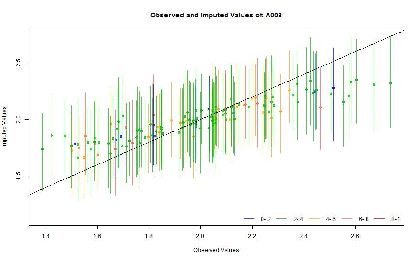
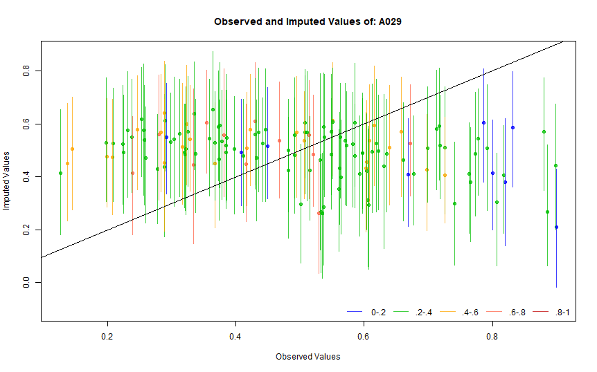
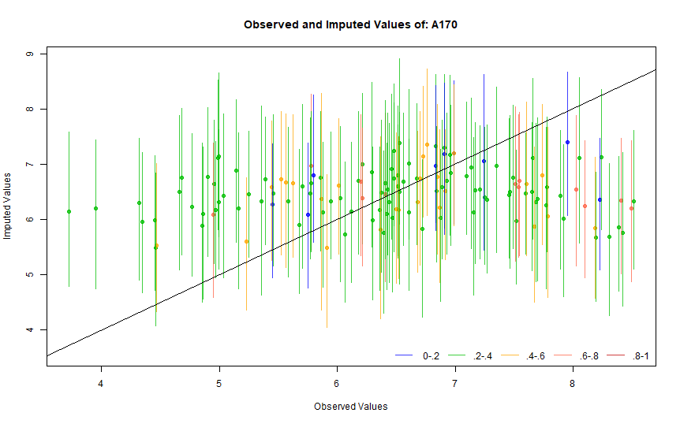
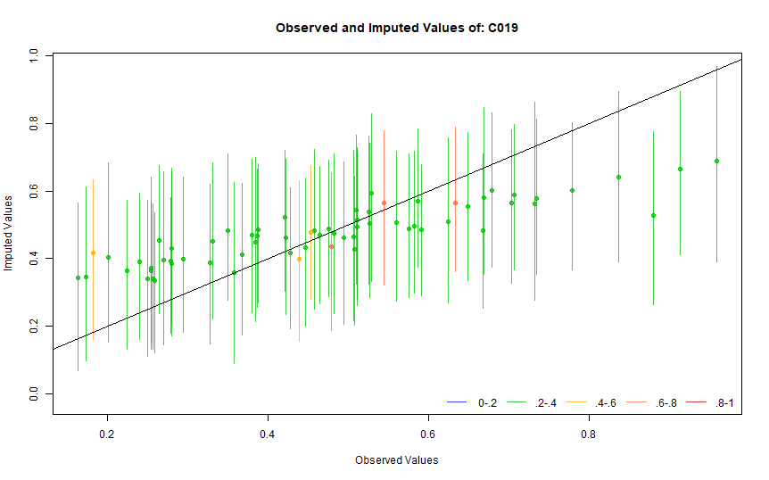
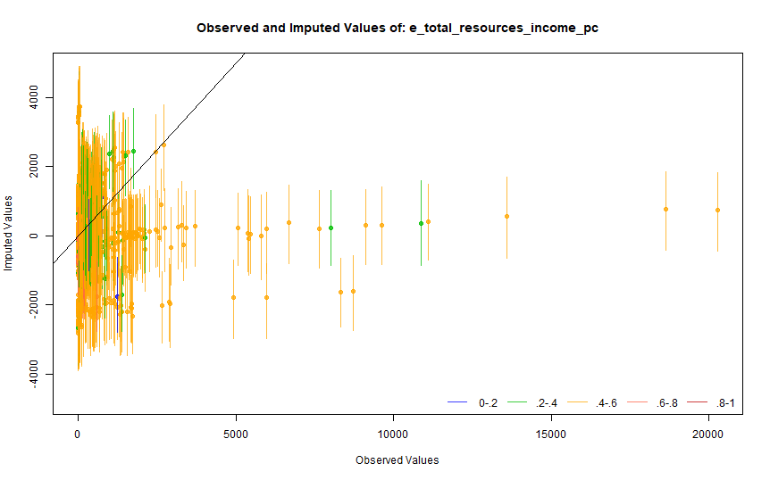
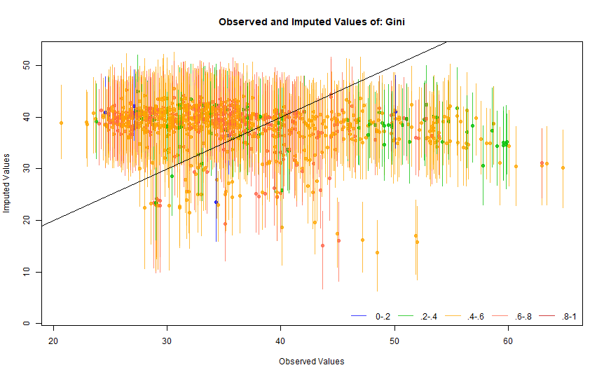
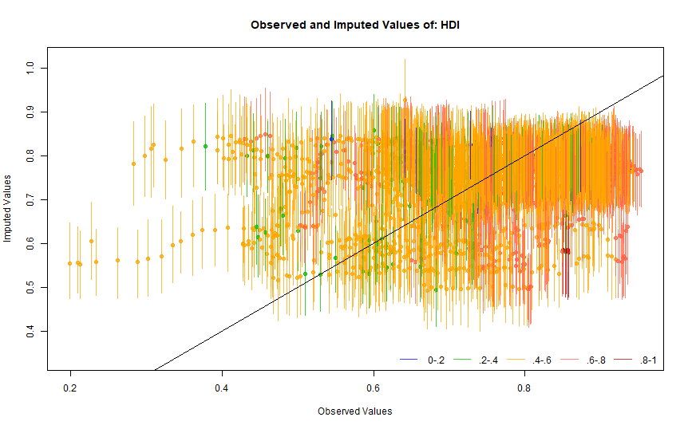
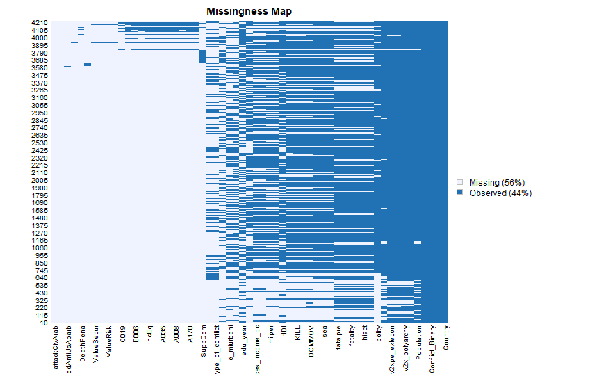
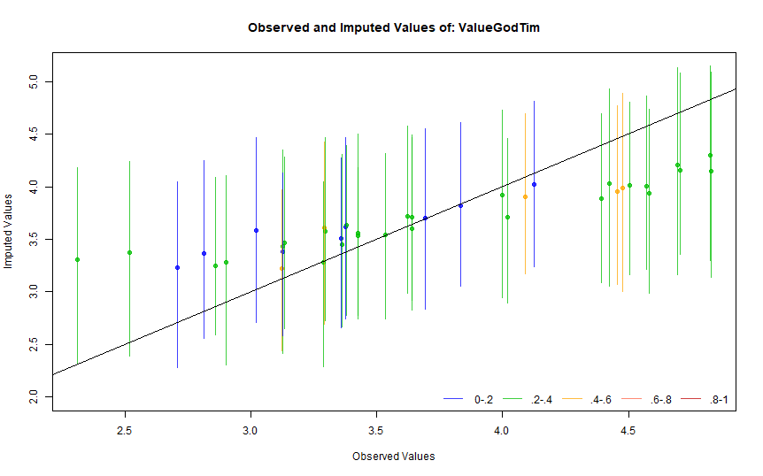

Appendix I
================
Eric G. E. Nilsen
2 5 2021

# Imputed vs. Observed Density

This part will show the density between the imputed and observed values
for all variables.

<!-- --><!-- --><!-- --><!-- --><!-- --><!-- --><!-- --><!-- --><!-- --><!-- --><!-- --><!-- --><!-- --><!-- --><!-- --><!-- --><!-- --><!-- --><!-- --><!-- --><!-- --><!-- --><!-- --><!-- --><!-- --><!-- --><!-- --><!-- --><!-- --><!-- --><!-- --><!-- --><!-- --><!-- --><!-- --><!-- --><!-- -->

# Overimputation

In addition to the the variables shown in part 4.3, this section will
present the results of overimputing all variables in the dataset.

# Variables

| Source          |                                                 Variable                                                  |    Period |
|-----------------|:---------------------------------------------------------------------------------------------------------:|----------:|
| WVS             |                                                   A189                                                    | 2005-2014 |
| WVS             |                                                   A190                                                    | 2005-2014 |
| WVS             |                                                   A191                                                    | 2005-2014 |
| WVS             |                                                   A192                                                    | 2005-2014 |
| WVS             |                                                   A193                                                    | 2005-2014 |
| WVS             |                                                   A194                                                    | 2005-2014 |
| WVS             |                                                   A195                                                    | 2005-2014 |
| WVS             |                                                   A196                                                    | 2005-2014 |
| WVS             |                                                   A197                                                    | 2005-2014 |
| WVS             |                                                   A198                                                    | 2005-2014 |
| WVS             |                                                   A199                                                    | 2005-2014 |
| WVS             |                                                   A035                                                    | 1981-2020 |
| WVS             |                                                   A039                                                    | 1981-2020 |
| WVS             |                                                   A008                                                    | 1981-2020 |
| WVS             |                                                   A029                                                    | 1981-2020 |
| WVS             |                                                   A170                                                    | 1981-2020 |
| WVS             |                                                   E012                                                    | 1981-2020 |
| WVS             |                                                 F114\_02                                                  | 2017-2020 |
| WVS             |                                                   E006                                                    | 1989-2020 |
| WVS             |                                                   C019                                                    | 1981-2004 |
| WVS             |                                                   A165                                                    | 1981-2020 |
| WVS             |                                                   E035                                                    | 1989-2020 |
| WVS             |                                                  E2333A                                                   | 2010-2020 |
| WVS             |                                                   X047                                                    | 1981-2020 |
| WVS             |                                                   X025R                                                   | 1981-2020 |
| WVS             |                                                   X003                                                    | 1981-2020 |
| WVS             |                                                   X001                                                    | 1981-2020 |
| WVS             |                                                   Y002                                                    | 1981-2020 |
| WVS             |                                                   Y003                                                    | 1981-2020 |
| Polity V        |                                                  polity                                                   | 1980-2020 |
| WB Open Data    |                                              NY.GDP.PCAP.CD                                               | 1980-2020 |
| WB Open Data    |                                                SP.POP.TOTL                                                | 1980-2020 |
| WB Open Data    |                                              EG.CFT.ACCS.ZS                                               | 1980-2020 |
| WB Open Data    |                                                SI.POV.GINI                                                | 1980-2020 |
| V-DEM v.11.1    |                                              v2x\_polyarchy                                               | 1980-2020 |
| V-DEM v.11.1    |                                             v2xpe\_exlgender                                              | 1980-2020 |
| V-DEM v.11.1    |                                      e\_total\_resources\_income\_pc                                      | 1980-2020 |
| V-DEM v.11.1    |                                                e\_pefeliex                                                | 1980-2020 |
| V-DEM v.11.1    |                                              v2xpe\_exlecon                                               | 1980-2020 |
| V-DEM v.11.1    |                                                e\_miurbani                                                | 1980-2020 |
| V-DEM v.11.1    |                                            v2x\_accountability                                            | 1980-2020 |
| V-DEM v.11.1    |                                        e\_total\_fuel\_income\_pc                                         | 1980-2020 |
| UNDP            |                                                    HDI                                                    | 1980-2020 |
| Afrobarometer   |                                          supdem ,q38,32,q30,q28                                           | 1999-2019 |
| Arabbarometer   |                                                 q604,q706                                                 | 2006-2018 |
| Arabbarometer   |                                                   q2476                                                   |      2006 |
| Arabbarometer   |                                                   q2476                                                   |      2006 |
| Latinobarometer | p19, sp31,sp28,P29ST,p46st, p32st, p14st,p13st,p16st,p17st,p9st,p13st, ,P10ST,P12STGBS, P11STGBS, P8STGBS | 1995-2018 |
| COW             |                                                majorpower                                                 | 1980-2012 |
| COW             |                                                   milex                                                   | 1980-2012 |
| COW             |                                                  milper                                                   | 1980-2012 |
| COW             |                                                   land                                                    | 1980-2012 |
| COW             |                                                    sea                                                    | 1980-2012 |
| COW             |                                                   cinc                                                    | 1980-2012 |
| COW             |                                                 num\_mem                                                  | 1980-2012 |
| MIDB 5.0        |                                                  dispnum                                                  | 1980-2014 |
| MIDB 5.0        |                                                   hiact                                                   | 1980-2014 |
| MIDB 5.0        |                                                  hostlev                                                  | 1980-2014 |
| MIDB 5.0        |                                                 fatality                                                  | 1980-2014 |
| MIDB 5.0        |                                                 fatalpre                                                  | 1980-2014 |
| CIRI            |                                                  DOMMOV                                                   | 1980-2011 |
| CIRI            |                                                   KILL                                                    | 1980-2011 |
| CIRI            |                                                  POLPRIS                                                  | 1980-2011 |
| CIRI            |                                                  PHYSINT                                                  | 1980-2011 |
| UCDP/PRIO       |                                            type\_of\_conflict                                             | 1980-2019 |
| UCDP/PRIO       |                                               conflict\_id                                                | 1980-2019 |
| UCDP/PRIO       |                                                  side\_a                                                  | 1980-2019 |
| UCDP/PRIO       |                                                  side\_b                                                  | 1980-2019 |
| UCDP/PRIO       |                                               side\_a\_2nd                                                | 1980-2019 |
| UCDP/PRIO       |                                               side\_b\_2nd                                                | 1980-2019 |
| UCDP/PRIO       |                                             intensity\_level                                              | 1980-2019 |

# Country-years

| Country              | observed                           | period    |
|:---------------------|:-----------------------------------|:----------|
| Albania              | 1998,2002                          | 1980-2020 |
| Algeria              | 2002,2014                          | 1980-2020 |
| Andorra              | 2005,2018                          | 1980-2020 |
| Argentina            | 1984,1991,1995,1999,2006,2013,2017 | 1980-2020 |
| Armenia              | 1997,2008,2011                     | 1980-2020 |
| Australia            | 1981,1995,2005,2012,2018           | 1980-2020 |
| Austria              | 1990,1999,2008                     | 1980-2020 |
| Azerbaijan           | 1997,2011                          | 1980-2020 |
| Bangladesh           | 1996,2002,2018                     | 1980-2020 |
| Belarus              | 1990,1996,2008,2011                | 1980-2020 |
| Belgium              | 1981,1990,1999,2009                | 1980-2020 |
| Bosnia & Herzegovina | 1998,2001                          | 1980-2020 |
| Brazil               | 1991,1997,2006,2014,2018           | 1980-2020 |
| Bulgaria             | 1991,1997,2006,2008                | 1980-2020 |
| Canada               | 1982,1990,2000,2006                | 1980-2020 |
| Chile                | 1990,1996,2000,2006,2012,2018      | 1980-2020 |
| China                | 1990,1995,2001,2007,2013,2018      | 1980-2020 |
| Colombia             | 1997,1998,2005,2012,2018           | 1980-2020 |
| Croatia              | 1996,2008                          | 1980-2020 |
| Cyprus               | 2006,2008,2011,2019                | 1980-2020 |
| Czechia              | 1991,1998,2008                     | 1980-2020 |
| Denmark              | 1981,1990,1999,2008                | 1980-2020 |
| Ecuador              | 2013,2018                          | 1980-2020 |
| Egypt                | 2001,2008,2013,2018                | 1980-2020 |
| Estonia              | 1990,1996,2008,2011                | 1980-2020 |
| Ethiopia             | 2007,2020                          | 1980-2020 |
| Finland              | 1981,1990,1996,2005,2009           | 1980-2020 |
| France               | 1981,1990,1999,2006,2008           | 1980-2020 |
| Georgia              | 1996,2008,2009,2014                | 1980-2020 |
| Germany              | 1981,1990,1997,2006,2008,2013,2018 | 1980-2020 |
| Ghana                | 2007,2012                          | 1980-2020 |
| Greece               | 1999,2008,2017                     | 1980-2020 |
| Guatemala            | 2004,2020                          | 1980-2020 |
| Hong Kong SAR China  | 2005,2014,2018                     | 1980-2020 |
| Hungary              | 1982,1991,1998,2008,2009           | 1980-2020 |
| Iceland              | 1984,1990,1999,2009                | 1980-2020 |
| India                | 1990,1995,2001,2006,2012           | 1980-2020 |
| Indonesia            | 2001,2006,2018                     | 1980-2020 |
| Iran                 | 2000,2007,2020                     | 1980-2020 |
| Iraq                 | 2004,2006,2013,2018                | 1980-2020 |
| Ireland              | 1981,1990,1999,2008                | 1980-2020 |
| Italy                | 1981,1990,1999,2005,2009           | 1980-2020 |
| Japan                | 1981,1990,1995,2000,2005,2010,2019 | 1980-2020 |
| Jordan               | 2001,2007,2014,2018                | 1980-2020 |
| Kazakhstan           | 2011,2018                          | 1980-2020 |
| Kyrgyzstan           | 2003,2011,2020                     | 1980-2020 |
| Latvia               | 1990,1996,2008                     | 1980-2020 |
| Lebanon              | 2013,2018                          | 1980-2020 |
| Lithuania            | 1990,1997,2008                     | 1980-2020 |
| Luxembourg           | 1999,2008                          | 1980-2020 |
| Malaysia             | 2006,2012,2018                     | 1980-2020 |
| Malta                | 1983,1991,1999,2008                | 1980-2020 |
| Mexico               | 1981,1990,1996,2000,2005,2012,2018 | 1980-2020 |
| Moldova              | 1996,2002,2006                     | 1980-2020 |
| Montenegro           | 1996,2001                          | 1980-2020 |
| Morocco              | 2001,2007,2011                     | 1980-2020 |
| Netherlands          | 1981,1990,1999,2006,2008,2012      | 1980-2020 |
| New Zealand          | 1998,2004,2011,2020                | 1980-2020 |
| Nigeria              | 1990,1995,2000,2012,2018           | 1980-2020 |
| North Macedonia      | 1998,2001                          | 1980-2020 |
| Norway               | 1982,1990,1996,2007,2008           | 1980-2020 |
| Pakistan             | 1997,2001,2012,2018                | 1980-2020 |
| Peru                 | 1996,2001,2006,2012,2018           | 1980-2020 |
| Philippines          | 1996,2001,2012,2019                | 1980-2020 |
| Poland               | 1989,1997,2005,2008,2012           | 1980-2020 |
| Portugal             | 1990,1999,2008,2020                | 1980-2020 |
| Puerto Rico          | 1995,2001,2018                     | 1980-2020 |
| Romania              | 1993,1998,2005,2008,2012,2018      | 1980-2020 |
| Russia               | 1990,1995,2006,2008,2011,2017      | 1980-2020 |
| Rwanda               | 2007,2012                          | 1980-2020 |
| Serbia               | 1996,2001,2006,2017                | 1980-2020 |
| Singapore            | 2002,2012                          | 1980-2020 |
| Slovakia             | 1990,1998,2008                     | 1980-2020 |
| Slovenia             | 1992,1995,2005,2008,2011           | 1980-2020 |
| South Africa         | 1982,1990,1996,2001,2006,2013      | 1980-2020 |
| South Korea          | 1982,1990,1996,2001,2005,2010,2018 | 1980-2020 |
| Spain                | 1981,1990,1995,2000,2007,2011      | 1980-2020 |
| Sweden               | 1982,1990,1996,1999,2006,2011      | 1980-2020 |
| Switzerland          | 1989,1996,2007,2008                | 1980-2020 |
| Taiwan               | 1998,2006,2012,2019                | 1980-2020 |
| Thailand             | 2007,2013,2018                     | 1980-2020 |
| Trinidad & Tobago    | 2006,2010                          | 1980-2020 |
| Tunisia              | 2013,2019                          | 1980-2020 |
| Turkey               | 1990,1996,2001,2007,2011,2018      | 1980-2020 |
| Ukraine              | 1996,2006,2008,2011,2020           | 1980-2020 |
| United Kingdom       | 1981,1990,1998,2005,2009           | 1980-2020 |
| United States        | 1982,1990,1995,1999,2006,2011,2017 | 1980-2020 |
| Uruguay              | 1996,2006,2011                     | 1980-2020 |
| Venezuela            | 1996,2000                          | 1980-2020 |
| Vietnam              | 2001,2006,2020                     | 1980-2020 |
| Zimbabwe             | 2001,2012,2020                     | 1980-2020 |
